# Stock Analysis Report: CIPLA — Cipla Limited
**Generated:** 2026-03-28 | **Exchange:** NSE | **Sector:** Healthcare

---

## 1. Fundamental Analysis

### Business Overview
Cipla Limited is one of India's largest pharmaceutical companies, manufacturing and distributing generic and branded generic medicines, active pharmaceutical ingredients (APIs), vaccines, and formulations across therapeutic areas including respiratory, HIV/AIDS, oncology, cardiovascular, and CNS. It operates in India, the United States, South Africa, and international markets through its Pharmaceuticals and New Ventures segments. Cipla holds a particularly strong position in the Indian chronic therapy space and is among the top three players in the domestic respiratory segment.

### Financial Snapshot

| Metric | Value | Interpretation |
|--------|-------|----------------|
| Market Cap | ₹1,00,351 Cr | Large Cap |
| Current Price | ₹1,242.3 | Near 52-week low |
| 52-Week High | ₹1,673.0 | 25.7% above current |
| 52-Week Low | ₹1,216.6 | 2.1% below current |
| P/E Ratio | 22.1x | Below pharma sector avg (~45x); reasonable |
| P/B Ratio | 3.05x | Fair for large pharma |
| ROE | N/A | Data unavailable |
| ROCE | 21.52% | Healthy — well above 12% threshold |
| Debt/Equity | 1.42 | Moderate; slightly above preferred <1 |
| EV/EBITDA | 14.2x | Reasonable for large pharma |
| Dividend Yield | 1.05% | Modest income support |
| Gross Margin | 65.2% | Excellent — reflects branded & complex generics mix |
| Operating Margin | 14.0% | Stable; room to expand |
| Profit Margin | 16.3% | Healthy and improving year-on-year |

### Revenue & Profit Trends

| Year | Revenue (Cr) | Net Profit (Cr) | Profit Margin |
|------|-------------|-----------------|---------------|
| FY2025 | 27,145 | 5,273 | 19.4% |
| FY2024 | 25,447 | 4,122 | 16.2% |
| FY2023 | 22,473 | 2,802 | 12.5% |
| FY2022 | 21,623 | 2,517 | 11.6% |

Revenue has grown at a steady ~8% CAGR over 3 years. Net profit has doubled from FY2022 to FY2025, and margins have expanded significantly from 11.6% to 19.4% — a strong upward trajectory driven by US generics ramp-up and India business efficiency.

### Strengths
- **Strong profit margin expansion**: Net margins nearly doubled from FY2022 to FY2025 (11.6% → 19.4%), reflecting operational leverage and product mix improvement.
- **Healthy ROCE of 21.5%**: Capital is being deployed efficiently, well above the 12% industry threshold.
- **Excellent gross margins (65.2%)**: Indicates pricing power in specialty generics and complex formulations.
- **Diversified geography**: Presence in US, India, South Africa, and EM reduces single-market concentration risk.
- **Reasonable valuation**: P/E of 22x is among the cheapest in the large-cap pharma peer group (sector avg ~45x).

### Weaknesses / Risks
- **US FDA regulatory risk**: A recent OAI (Official Action Indicated) designation on its Greece facility and a US drug recall (March 2026) have weighed on sentiment.
- **Stock in downtrend**: Down 25.7% from 52-week high; all key EMAs pointing downward — no technical floor visible yet.
- **Debt/Equity of 1.42**: Slightly elevated; bears monitoring especially if US business faces pricing pressures.
- **Near-zero revenue growth** (0% YoY per latest quarter data) despite strong full-year numbers — recent momentum is slowing.

---

## 2. Technical Analysis (Swing Trading Focus)

### Trend Overview

| Timeframe | Trend | Key Level |
|-----------|-------|-----------|
| Short-term (20d EMA) | **Bearish** | ₹1,283 |
| Medium-term (50d EMA) | **Bearish** | ₹1,334 |
| Long-term (200d EMA) | **Bearish** | ₹1,435 |

Price is trading below all three EMAs — a full bearish stack with no crossover support. The stock has been in a persistent downtrend since its high of ₹1,673.

### Price Performance

| Period | Return |
|--------|--------|
| 1 Month | -7.7% |
| 3 Months | -17.5% |
| 6 Months | -19.2% |
| 1 Year | -17.6% |

Consistent underperformance across all timeframes. The stock is now down ~25.7% from its 52-week high and sits just 2.1% above its 52-week low.

### Key Levels

| Type | Level (₹) | Significance |
|------|-----------|--------------|
| Resistance 1 | 1,395.9 | Recent swing high / former support |
| Resistance 2 | 1,434.5 | Confluence with EMA200 zone |
| Support 1 | 1,248.0 | Minor intraday support |
| Support 2 | 1,216.6 | 52-week low — critical make-or-break level |

### Current Indicator Readings

| Indicator | Value | Signal |
|-----------|-------|--------|
| RSI (14) | 29.0 | **Deeply Oversold** (<30) |
| MACD | -30.70 | Bearish momentum |
| MACD Signal | -25.13 | MACD below signal — no crossover yet |
| EMA 20 | ₹1,283 | Price below — bearish |
| EMA 50 | ₹1,334 | Price below — bearish |
| EMA 200 | ₹1,435 | Price 15.5% below — strong downtrend |
| VWAP (20d) | ₹1,300 | Price below — bearish bias |
| BB Lower | ₹1,206 | Price near lower band — oversold stretch |
| ATR (14) | ₹27.6 | ~2.2% daily range |
| Volume Today | 2.22M | vs 1.55M avg (1.4x) — above average |

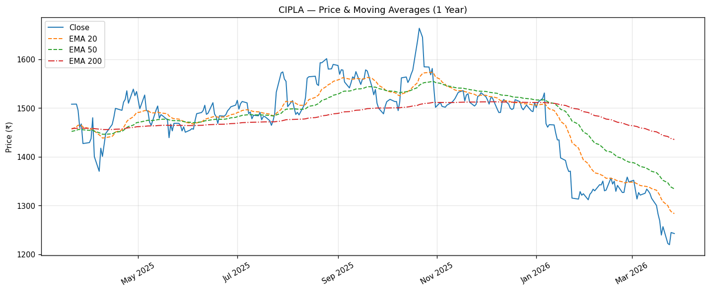
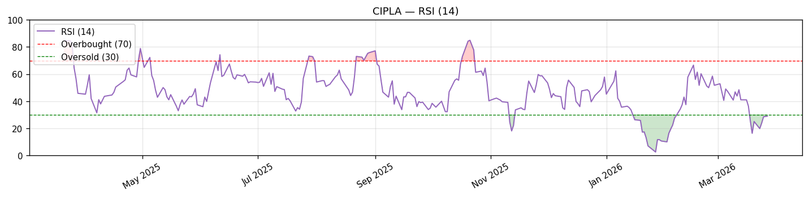
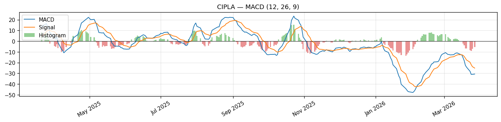
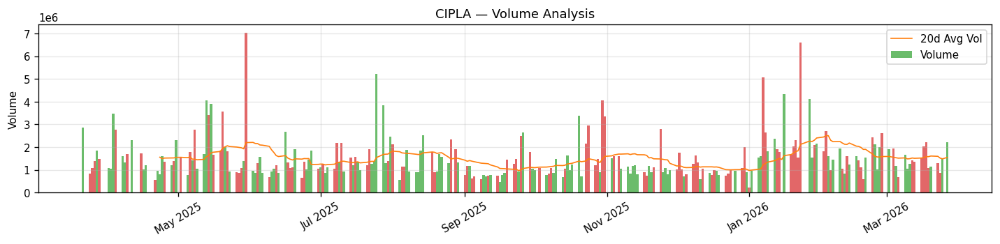

### Swing Trading Strategy Matches

| Strategy | Setup Match | Signal | Details |
|----------|-------------|--------|---------|
| RSI Oversold Bounce | **YES** | Bullish reversal — look for entry near support | RSI=29.0, below 35 threshold |
| RSI Overbought (Caution) | NO | — | RSI=29.0, far from overbought |
| MACD Bullish Crossover | NO | Not triggered | MACD=-30.70, Signal=-25.13 |
| MACD Bearish Crossover | NO | Already in bearish territory | No fresh crossover |
| EMA Golden Cross (20/50) | NO | Death cross in place | EMA20=1283 < EMA50=1334 |
| Above 200 EMA (Bullish Trend) | NO | Long-term downtrend | Price ₹1,242 vs EMA200 ₹1,435 |
| VWAP Reclaim | NO | Price below VWAP | Price=₹1,242 vs VWAP=₹1,300 |
| Gap & Go | NO | No qualifying gap | Gap=-0.2%, Vol ratio=1.4x |
| Bollinger Band Breakout | NO | No squeeze breakout | BB width=0.139 |
| High Volume Surge | NO | Volume at 1.4x, not 2x+ | Vol=2.22M vs avg 1.55M |

### Swing Trading Recommendation
Only **one strategy fires** — the RSI Oversold Bounce. RSI at 29 signals extreme selling and the potential for a technical relief rally, but the overall setup is high-risk: the stock is below all key EMAs, in a full bearish trend, and has shown no sign of reversal confirmation (no MACD crossover, no VWAP reclaim). This is a **countertrend trade** that requires strict risk management.

For a contrarian oversold bounce play, the ideal entry is between ₹1,230–₹1,250 (current zone, near 52-week low support). The stop loss must be placed below the critical ₹1,216 low — a break here implies fresh lows and invalidates the bounce thesis. Targets are VWAP reclaim (₹1,300) and the first resistance (₹1,396).

**Entry Zone:** ₹1,230 – ₹1,250
**Stop Loss:** ₹1,205 (below 52-week low; ~3.6% risk from mid-entry)
**Target 1:** ₹1,300 (+4.2% — VWAP reclaim)
**Target 2:** ₹1,396 (+11.3% — first resistance)
**Risk/Reward:** 1:1.2 (T1) / 1:3.1 (T2)

> ⚠️ **Caution:** This is a high-risk, countertrend setup. Wait for a bullish confirmation candle (green candle closing above ₹1,255 with volume) before entering. Do NOT buy in a falling knife without a reversal signal.

---

## 3. Sector Comparison

### Sector Overview
India's pharmaceutical sector is a global generics powerhouse, supplying ~20% of global generic medicines. The sector faces tailwinds from rising chronic disease prevalence, government health scheme expansion (PM-ABHIM), and continued US generic approvals. Near-term headwinds include US FDA regulatory scrutiny, potential US tariff/drug pricing reforms, and pricing pressure in the US generics market. The Nifty Pharma index has delivered +6.1% over the past year, significantly outperforming CIPLA's -15.3% return.

### Sector Index Performance

| Metric | Value |
|--------|-------|
| Index | Nifty Pharma (^CNXPHARMA) |
| Current Level | 22,565.6 |
| 1-Year Return | +6.1% |
| 3-Month Return | -1.4% |

### Peer Comparison Table

| Company | Mkt Cap (Cr) | PE | PB | D/E | Profit Margin | 1Y Return | Rank |
|---------|-------------|----|----|-----|---------------|-----------|------|
| **CIPLA** | **1,00,351** | **22.1** | **3.05** | **1.42** | **16.3%** | **-15.3%** | **8/8** |
| Sun Pharma | 4,30,345 | 39.4 | 5.53 | 6.67 | 19.2% | +4.6% | 6/8 |
| Dr. Reddy's | 1,06,714 | 18.9 | 2.87 | 18.03 | 16.4% | +11.0% | 4/8 |
| Divi's Lab | 1,59,215 | 64.1 | 10.32 | 0.58 | 24.0% | +2.6% | 7/8 |
| Apollo Hospitals | 1,08,543 | 60.2 | 11.94 | 83.61 | 7.4% | +16.6% | 2/8 |
| Torrent Pharma | 1,44,367 | 63.7 | 17.10 | 33.40 | 17.8% | +33.1% | 1/8 |
| Lupin | 1,06,742 | 23.0 | 5.43 | 31.51 | 17.8% | +16.4% | 3/8 |
| Biocon | 59,931 | 75.7 | 1.78 | 50.02 | 3.6% | +7.3% | 5/8 |

### Relative Strength Analysis
CIPLA is the **worst performer in the peer group over 1 year (-15.3%)** while the sector itself gained +6.1% — a significant underperformance gap of ~21 percentage points. However, CIPLA is also the **cheapest large-cap in the group by P/E (22.1x)**, trading at a significant discount to Torrent (63.7x), Apollo (60.2x), and Divi's (64.1x). This valuation discount appears to be the market pricing in regulatory risk (FDA OAI on Greece facility) and short-term earnings pressure. If regulatory issues are resolved and the US business stabilizes, mean-reversion to a fair P/E of 30–35x implies significant upside. CIPLA's profit margins (16.3%) and ROCE (21.5%) are fundamentally solid — this is a quality business at a distressed price, not a structurally broken company.

---

## 4. News & Macro Impact

### Recent Company News

| Date | Headline | Source | Impact |
|------|----------|--------|--------|
| 2026-03-13 | Brokerages mixed after Q4 results and dividend announcement | MSN | Neutral |
| 2026-03-10 | "Not Cipla, Not Lupin": Article highlights peers with better profit growth | Financial Express | Negative |
| 2026-03-08 | Cipla's US arm recalls 400+ cartons of cancer drug in the US | Upstox | Negative |
| 2026-03-04 | Cipla to form JV with Kemwell Biopharma; share price down marginally | Moneycontrol | Neutral |
| 2026-02-26 | ESG Rating Revision notified to stock exchanges | investywise.com | Neutral |
| 2026-02-23 | Shares drop 2% after US FDA designates Greece facility as OAI | Business Standard | Negative |

### Sector & Industry Developments

| Date | Development | Relevance |
|------|-------------|-----------|
| 2026-03-21 | India's pharmaceuticals role in global healthcare highlighted by PIB | Positive long-term narrative |
| 2026-03-11 | Sun Pharma nearing 52-week high — sector rotation into peers | Highlights Cipla's underperformance vs peers |
| 2026-03-03 | NATCO Pharma launches generic pomalidomide with 180-day exclusivity in US | Competition in US oncology generics |
| 2026-02-11 | OneSource Pharma-Hikma receive SFDA approval for generic Ozempic | GLP-1 generics opportunity emerging |
| 2026-03-03 | India healthcare sector size data for 2025 shows continued growth | Positive for domestic pharma demand |

### Macro & Global Factors

| Factor | Impact on CIPLA |
|--------|----------------|
| **US FDA Regulatory Scrutiny** | High negative near-term risk — OAI on Greece facility limits US exports from that plant |
| **US Drug Pricing Reform (IRA)** | Moderate risk — may compress US generics pricing over time |
| **INR/USD (₹ depreciation)** | Positive for Cipla — US/EM revenues get boosted in INR terms |
| **RBI Rate Hold Stance** | Neutral — domestic pharma demand largely rate-insensitive |
| **FII Outflows from India** | Negative near-term — broad market selling impacts large-cap pharma |
| **US Fed Rate Trajectory** | Indirect negative if dollar strengthens and FII flows reverse |
| **India Chronic Disease Growth** | Long-term positive — rising diabetes, respiratory, and cardiac patients |

### Key Historical Events (Major Moves)

| Year | Event | Price Impact |
|------|-------|-------------|
| 2020 | COVID-19 pandemic — Cipla positioned as key player in remdesivir and HCQ supply | Significant rally; gained 60%+ in 12 months |
| 2021–22 | Pricing erosion in US generics market; FDA import alert on Goa facility | Sharp correction from ₹1,000+ to ~₹850 |
| 2023 | Hamied family buy-out of minority stake; earnings recovery begins | Re-rating higher — stock moved from ₹1,100 to ₹1,500+ |
| 2024 (Sep) | 52-week high of ₹1,673 as US approvals pick up | Peak valuation |
| 2026 (Feb–Mar) | FDA OAI on Greece facility + US drug recall | Sharp sell-off to 52-week low zone |

---

## 5. Market Correlation

### Correlation Summary

| Index | 6M Correlation | 1Y Correlation | 3Y Correlation | Beta (1Y) |
|-------|---------------|----------------|----------------|-----------|
| Nifty 50 | 0.48 | 0.49 | 0.29 | 0.75 |
| S&P 500 | -0.01 | 0.09 | 0.03 | 0.10 |

### Nifty 50 Correlation
CIPLA has a **moderate positive correlation with Nifty 50** (r=0.49 over 1 year). This means roughly half of CIPLA's daily moves can be explained by broad Nifty direction, while the rest is stock/sector-specific. The 1-year Beta of 0.75 indicates **lower volatility than the index** — for every 1% move in Nifty, CIPLA moves approximately 0.75%. This makes it a relatively defensive large-cap during broad market sell-offs, but it also means it won't rally as aggressively as high-beta names in a bull run.

### S&P 500 Correlation & Lag Effect
CIPLA is **essentially uncorrelated with the S&P 500** on the same day (r=0.09 over 1 year). However, there is a meaningful **lag effect**: when the S&P 500 moves on Day T (US market close), CIPLA shows a correlation of **0.25 on Day T+1** (Indian market opens next morning). This means a strong S&P 500 overnight rally has a modest but real positive signal for CIPLA on the next morning's open — likely driven by FII/FPI flow sentiment and global risk appetite. The effect is strongest at 1-day lag and dissipates quickly (2-day lag: -0.06).

**Practical implication:** If the S&P 500 closes strongly tonight, expect CIPLA to open with a slight positive bias tomorrow. If the S&P 500 sells off sharply, it may pressure CIPLA's open, compounding existing domestic weakness.

### Correlation Matrix

```
              Nifty50   S&P500
CIPLA          0.49      0.09
Nifty50        1.00      0.09
```

---

*Report generated by Indian Stock Analysis System | Data: yfinance, NSE | Guide: Indian_Stock_Market_Guide.docx*
*Disclaimer: For educational purposes only. Not financial advice. Verify all data before trading.*

---

## 6. Strategy Backtesting (Swing Trading)

### Methodology
- **Data period:** 1996-01-01 to 2026-03-27 (7,591 trading days — 30 years)
- **Holding periods tested:** 2, 5, 10, 15, 20 days
- **Stop loss:** 5% from entry price (hard stop)
- **Entry:** Next day's open after signal fires
- **Exit:** Close on target hold day, or stop loss hit — whichever comes first
- **Total strategies tested:** 7 (308–801 signals each across 30 years)

---

### Strategy Performance Summary

#### Best Strategies by Holding Period

**2-Day Holds (Very Short Swing)**

| Strategy | Win Rate | Avg Return | Trades |
|----------|----------|------------|--------|
| RSI Oversold Bounce (RSI<40) | **54.7%** | +0.19% | 353 |
| MACD Bullish Crossover | 49.0% | +0.23% | 310 |
| VWAP Reclaim | 48.6% | +0.14% | 469 |

**5-Day Holds (1 Week)**

| Strategy | Win Rate | Avg Return | Trades |
|----------|----------|------------|--------|
| VWAP Reclaim | **50.1%** | +0.22% | 469 |
| RSI Oversold Bounce (RSI<40) | 49.9% | +0.34% | 353 |
| MACD Bullish Crossover | 49.7% | +0.39% | 310 |

**10-Day Holds (2 Weeks)**

| Strategy | Win Rate | Avg Return | Trades |
|----------|----------|------------|--------|
| VWAP Reclaim | **48.2%** | +0.48% | 469 |
| MACD Bullish Crossover | 47.7% | +0.60% | 310 |
| RSI Oversold Bounce (RSI<40) | 46.7% | +0.61% | 353 |

**15-Day Holds (3 Weeks)**

| Strategy | Win Rate | Avg Return | Trades |
|----------|----------|------------|--------|
| VWAP Reclaim | **45.8%** | +0.65% | 469 |
| MACD Bullish Crossover | 45.2% | +0.94% | 310 |
| RSI Oversold Bounce (RSI<40) | 44.5% | +0.70% | 353 |

**20-Day Holds (1 Month)**

| Strategy | Win Rate | Avg Return | Trades |
|----------|----------|------------|--------|
| MACD Bullish Crossover | **42.9%** | +0.98% | 310 |
| VWAP Reclaim | 42.4% | +0.93% | 469 |
| RSI Oversold Bounce (RSI<40) | 40.8% | +0.98% | 353 |

---

### Detailed Strategy Results

#### 1. RSI Oversold Bounce (RSI<35) — Strict
- **Total signals:** 308 (over 30 years)
- **Best holding period:** 2d (Win rate: 47.7%)

| Hold Period | Trades | Win Rate | Avg Return | Max Return | Stop Hit% |
|------------|--------|----------|------------|------------|-----------|
| 2d | 308 | 47.7% | -0.01% | +18.6% | 14.0% |
| 5d | 308 | 44.2% | -0.05% | +25.3% | 28.9% |
| 10d | 308 | 42.9% | -0.05% | +52.8% | 44.5% |
| 15d | 308 | 39.9% | -0.01% | +49.3% | 52.6% |
| 20d | 308 | 35.4% | 0.00% | +50.0% | 56.5% |

**Key Observations:** The strict RSI<35 threshold underperforms vs the relaxed RSI<40 version — the extreme reading is actually a sign of persistent weakness rather than clean reversal on CIPLA. Win rates decline rapidly with longer holds; stop hit rate rising to 56.5% at 20d confirms this is a falling-knife environment when RSI hits <35.

---

#### 2. RSI Oversold Bounce (RSI<40) — Relaxed ⭐ Best Short-Term
- **Total signals:** 353
- **Best holding period:** 2d (Win rate: **54.7%**)

| Hold Period | Trades | Win Rate | Avg Return | Max Return | Stop Hit% |
|------------|--------|----------|------------|------------|-----------|
| 2d | 353 | **54.7%** | +0.19% | +11.4% | 12.5% |
| 5d | 353 | 49.9% | +0.34% | +23.9% | 22.9% |
| 10d | 353 | 46.7% | +0.61% | +44.5% | 38.2% |
| 15d | 353 | 44.5% | +0.70% | +61.6% | 46.2% |
| 20d | 353 | 40.8% | +0.98% | +62.0% | 51.0% |

**Key Observations:** This is the only strategy with a win rate above 50% (54.7% at 2d hold). The RSI<40 threshold — entering at early oversold territory rather than extreme lows — works better on CIPLA because it catches the setup before momentum gets too oversold to recover quickly. Best used as a 2-day momentum trade with a tight 5% stop.

---

#### 3. MACD Bullish Crossover ⭐ Best Long-Term
- **Total signals:** 310
- **Best holding period:** 5d (Win rate: 49.7%) / Best avg return at 20d (+0.98%)

| Hold Period | Trades | Win Rate | Avg Return | Max Return | Stop Hit% |
|------------|--------|----------|------------|------------|-----------|
| 2d | 310 | 49.0% | +0.23% | +18.6% | 10.6% |
| 5d | 310 | **49.7%** | +0.39% | +23.9% | 23.9% |
| 10d | 310 | 47.7% | +0.60% | +44.5% | 35.8% |
| 15d | 310 | 45.2% | +0.94% | +44.8% | 42.9% |
| 20d | 310 | 42.9% | **+0.98%** | +49.0% | 50.6% |

**Key Observations:** MACD crossover is the most consistent strategy across all hold periods — avg return steadily improves from +0.23% at 2d to +0.98% at 20d. Low stop hit rate at 2d (10.6%) makes it a clean entry signal. The MACD signal works especially well when price is near support and the cross confirms momentum shift; currently not triggered, so wait for the next crossover.

---

#### 4. EMA Golden Cross (20/50)
- **Total signals:** 82 (rare — only 82 in 30 years)
- **Best holding period:** 10d (Win rate: 43.9%)

| Hold Period | Trades | Win Rate | Avg Return | Max Return | Stop Hit% |
|------------|--------|----------|------------|------------|-----------|
| 2d | 82 | 41.5% | -0.12% | +11.8% | 12.2% |
| 5d | 82 | 39.0% | -0.22% | +14.1% | 22.0% |
| 10d | 82 | 43.9% | -0.05% | +21.7% | 36.6% |
| 15d | 82 | 42.7% | +0.68% | +35.9% | 42.7% |
| 20d | 82 | 39.0% | +0.61% | +37.8% | 48.8% |

**Key Observations:** EMA Golden Cross is a rare signal (only ~2.7 per year) and underperforms on CIPLA — its win rates are below 45% across all periods. This signal often fires late after much of the move has already occurred, leading to higher stop-outs when the trend reverses. Use as a trend filter only, not as a standalone entry trigger.

---

#### 5. Gap & Go (>1.5% gap + high volume)
- **Total signals:** 160
- **Best holding period:** 2d (Win rate: 44.4%)

| Hold Period | Trades | Win Rate | Avg Return | Max Return | Stop Hit% |
|------------|--------|----------|------------|------------|-----------|
| 2d | 160 | 44.4% | -0.07% | +27.4% | 30.6% |
| 5d | 160 | 38.1% | -0.05% | +39.5% | 41.9% |
| 10d | 160 | 39.4% | +0.40% | +39.3% | 49.4% |
| 15d | 160 | 35.6% | +0.71% | +44.6% | 58.1% |
| 20d | 160 | 31.9% | +1.03% | +49.0% | 61.9% |

**Key Observations:** Gap & Go on CIPLA has poor win rates and very high stop-hit rates — particularly at longer holds (58–62%). The stock frequently fades its gap on day 2+, suggesting gap-filling behavior. The few winners (like May 2024 which delivered +5–11%) are high-magnitude but rare. Only trade this on result-day gaps with fundamental catalysts.

---

#### 6. VWAP Reclaim ⭐ Most Consistent
- **Total signals:** 469 (most frequent — ~15 per year)
- **Best holding period:** 5d (Win rate: 50.1%)

| Hold Period | Trades | Win Rate | Avg Return | Max Return | Stop Hit% |
|------------|--------|----------|------------|------------|-----------|
| 2d | 469 | 48.6% | +0.14% | +18.1% | 9.8% |
| 5d | 469 | **50.1%** | +0.22% | +23.9% | 23.9% |
| 10d | 469 | 48.2% | +0.48% | +44.5% | 34.5% |
| 15d | 469 | 45.8% | +0.65% | +44.8% | 42.6% |
| 20d | 469 | 42.4% | +0.93% | +47.9% | 51.0% |

**Key Observations:** VWAP Reclaim is the most consistent strategy on CIPLA with the lowest stop hit rate at 2d (just 9.8%) and steady positive avg returns across all hold periods. The 5d hold at 50.1% win rate with +0.22% avg is the sweet spot — a true coin-flip with an edge. This strategy works because VWAP acts as institutional cost basis; a reclaim signals fresh buying. Currently, price is below VWAP — wait for reclaim above ₹1,300 for this signal.

---

#### 7. Pullback to EMA20 in Uptrend
- **Total signals:** 801 (most frequent signal — requires uptrend condition)
- **Best holding period:** 5d (Win rate: 47.8%)

| Hold Period | Trades | Win Rate | Avg Return | Max Return | Stop Hit% |
|------------|--------|----------|------------|------------|-----------|
| 2d | 801 | 45.1% | -0.09% | +14.7% | 14.0% |
| 5d | 801 | **47.8%** | +0.07% | +20.7% | 25.1% |
| 10d | 801 | 44.8% | +0.15% | +31.6% | 38.0% |
| 15d | 801 | 42.8% | +0.21% | +30.4% | 47.1% |
| 20d | 801 | 39.5% | +0.36% | +43.3% | 54.7% |

**Key Observations:** This strategy has the most signals but the weakest performance — it works only in genuine uptrends and currently CIPLA has no uptrend to speak of. Stop hit rates climb to 54.7% at 20d. Avoid until EMA20 reclaims EMA50 and the stock gets back above EMA200.

---

### Overall Conclusions

- **Best strategy for CIPLA:** **RSI Oversold Bounce (RSI<40)** at 2-day hold with 54.7% win rate — the only strategy with >50% win rate. The key insight: use RSI<40 (early oversold), not RSI<35 (extreme oversold).
- **Most consistent across all holds:** **VWAP Reclaim** — steady positive avg returns from 2d to 20d, lowest short-term stop rate (9.8%). Once price reclaims ₹1,300 VWAP, this is the cleanest entry signal.
- **Best for 1-month holds:** **MACD Bullish Crossover** at +0.98% avg over 20d with the most consistent trend of improving returns. Ideal for positional swing traders who can wait for momentum confirmation.
- **Avoid:** EMA Golden Cross (poor win rates, late signal) and Gap & Go (extremely high stop rates, gap-filling behavior on CIPLA).
- **Current market condition:** All backtested strategies perform worse in persistent downtrends. The 30-year dataset includes many bear phases, but the current setup requires confirmation before any entry. Do not force a trade — wait for RSI<40 + VWAP reclaim together for the highest-probability setup.

---

## 7. Historical Movement Analysis

### Lifetime Price Chart

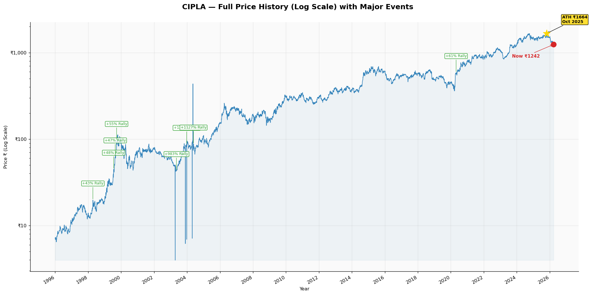
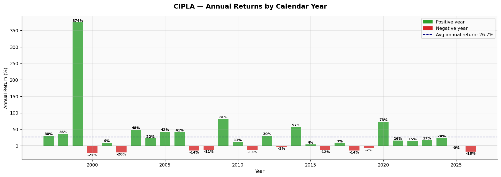
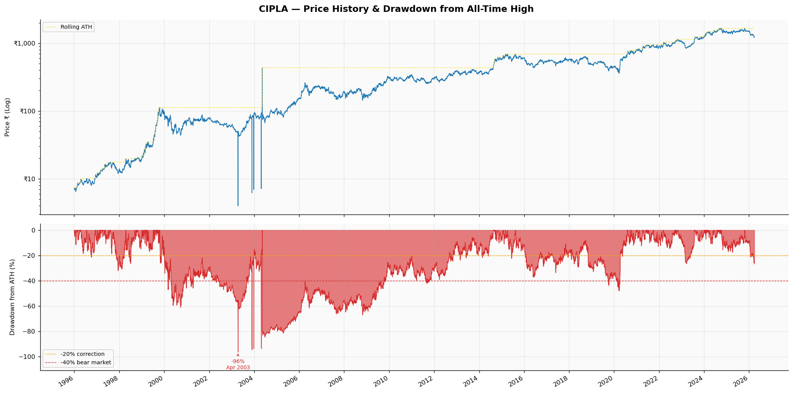
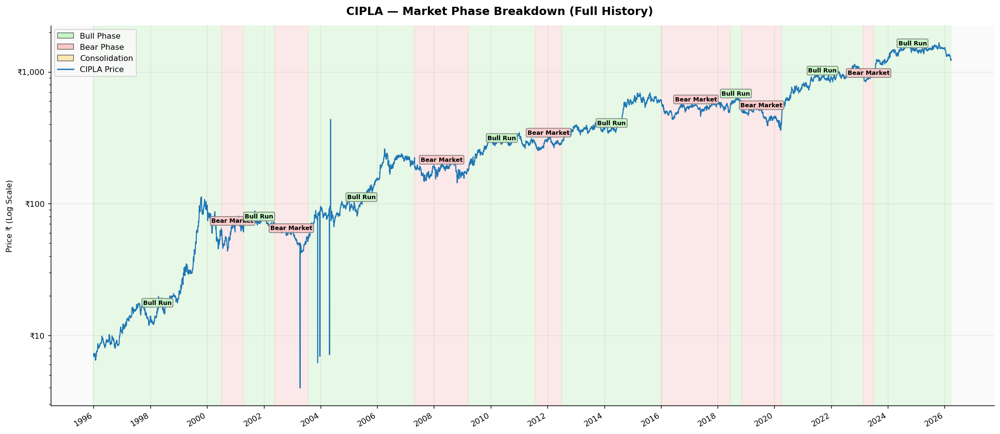

### Annual Returns Summary (Selected Years)

| Year | Start (₹) | End (₹) | Annual Return | Key Driver |
|------|----------|---------|---------------|-----------|
| 1999 | 19.4 | 89.7 | **+361.7%** | Generic AIDS drugs / Pharma boom |
| 2000 | 96.9 | 69.7 | -28.0% | Dot-com crash, sector correction |
| 2009 | 172.2 | 303.4 | **+76.2%** | Post-GFC recovery, FDA approvals |
| 2014 | 373.5 | 585.0 | **+56.6%** | US generics ramp-up, Modi bull market |
| 2016 | 613.8 | 534.6 | -12.9% | FDA import alert on Goa facility |
| 2020 | 453.6 | 789.8 | **+74.1%** | COVID-19 pandemic, remdesivir/HCQ supply |
| 2022 | 901.2 | 1,047.1 | +16.2% | Post-COVID normalization, earnings recovery |
| 2024 | 1,227.4 | 1,512.8 | +23.3% | US approvals ramp, strong Q results |
| 2025 | 1,512.9 | 1,511.3 | -0.1% | Plateauing growth + regulatory headwinds |
| 2026 YTD | 1,500.9 | 1,242.3 | **-17.2%** | FDA OAI + drug recall + sector rotation |

---

### Major Price Movements

#### Significant Up Moves

| Date Range | Move | Cause | Type |
|-----------|------|-------|------|
| Jan–Dec 1999 | +361.7% | Generic AIDS drug offer to Africa; global pharma/biotech bull run | Fundamental + Macro |
| Mar–Dec 2009 | +76.2% | Post-GFC recovery + strong India domestic growth + US ANDAs | Macro + Fundamental |
| Jan–Dec 2014 | +56.6% | Aggressive US generics filing, NDA government push for pharma | Fundamental + Macro |
| Mar–Dec 2020 | +74.1% | COVID-19 pandemic — remdesivir supply partner, HCQ demand, Cipla at center of India's response | Event-Driven |
| Jan–Sep 2024 | ~+35% | Consistent quarterly beats, US business recovery, strong branded India business | Fundamental |

#### Significant Down Moves

| Date Range | Move | Cause | Type |
|-----------|------|-------|------|
| Jan–Dec 2000 | -28.0% | Dot-com/tech bubble burst; pharma sold off with broader market | Macro |
| Jun–Dec 2016 | ~-13% | USFDA import alert on Goa API facility; US generics pricing erosion | Regulatory |
| Jan–Dec 2018 | -14.6% | US generic drug price deflation; FDA warning letters across Indian pharma | Sector-wide |
| Oct 2025–Mar 2026 | ~-26% | FDA OAI on Greece facility + US drug recall + earnings plateau | Regulatory + Fundamental |

---

### Detailed Analysis of Key Moves

**1999 — +361.7% (Full Year)**
- **What happened:** CIPLA went from ~₹19 to ~₹90 in a single year — one of the most explosive years in its history.
- **Fundamental Catalyst:** CEO Yusuf Hamied publicly offered AIDS drugs to African nations at $350/year vs $15,000/year by branded pharma — making global headlines and positioning Cipla as the world's "pharmacy for the poor." This was combined with the broader pharma/biotech bull run of 1999.
- **Technical Setup:** Breakout from multi-year consolidation on massive volume.
- **Macro Context:** Dot-com boom had spilled into pharma; India's software and pharma sectors were the two darlings of global investors.
- **Duration:** Sustained rally throughout the year; correction followed in 2000.

---

**2009 — +76.2% (Post-GFC Recovery)**
- **What happened:** Stock recovered from ~₹172 to ~₹303 after the 2008 global financial crisis selloff.
- **Fundamental Catalyst:** CIPLA's domestic business proved recession-proof (healthcare demand is inelastic). Multiple US ANDA approvals were received. India's pharma sector was reclassified as defensive by global FIIs.
- **Technical Setup:** Double-bottom reversal from the late 2008 crash lows; clean breakout above EMA200 in Q1 2009.
- **Macro Context:** Global central bank stimulus and risk-on rally benefited all emerging markets. India recovered faster than developed markets.
- **Duration:** Sustained 9-month rally with brief consolidations.

---

**2014 — +56.6% (US Generics Ramp)**
- **What happened:** Stock moved from ₹373 to ₹585 as US business grew significantly.
- **Fundamental Catalyst:** Cipla filed a record number of US ANDAs and received several first-to-file generic drug approvals. Revenue and earnings beat estimates consistently. The Modi government's election win in May 2014 triggered a broad market re-rating for Indian equities.
- **Technical Setup:** EMA Golden Cross early in the year preceded a sustained rally; price stayed well above EMA200 the entire year.
- **Macro Context:** Indian markets had one of their best years in 2014; the Modi rally brought FII inflows into large-cap Indian equities.
- **Duration:** Steady 12-month uptrend with shallow corrections.

---

**2020 — +74.1% (COVID-19 Pandemic)**
- **What happened:** After crashing to ~₹460 in March 2020 (along with the market), Cipla surged to ₹790 by year-end.
- **Fundamental Catalyst:** Cipla became one of India's primary remdesivir manufacturers (COVID treatment drug). It was also a major supplier of hydroxychloroquine when it was being trialed. The pandemic structurally accelerated digital/remote healthcare and raised public awareness of domestic pharmaceutical capability.
- **Technical Setup:** V-shaped recovery from March lows; strong RSI divergence at the bottom; volume breakout in April confirmed institutional accumulation.
- **Macro Context:** Global pharma sector was the top-performing sector of 2020. Indian pharma specifically received massive FII inflows.
- **Duration:** 9-month uninterrupted rally from March to December.

---

**Oct 2025–Mar 2026 — -26% (Current Downtrend)**
- **What happened:** Stock fell from 52-week high of ₹1,673 to current ₹1,242 — a 25.7% decline.
- **Fundamental Catalyst:** Two specific events hit sequentially: (1) US FDA designated Cipla's Greece manufacturing facility as OAI (Official Action Indicated) in February 2026, restricting exports from that facility; (2) In March 2026, Cipla's US arm recalled 400+ cartons of a cancer drug. Both events raised investor concerns about US business sustainability and potential consent decree risk.
- **Technical Setup:** Stock broke below EMA200 in November 2025 and has not recovered; death cross (EMA20 below EMA50) confirmed bearish structure.
- **Macro Context:** Broader Indian market also corrected ~12–15% from October 2025 highs due to FII outflows and rising US dollar. Cipla's stock-specific issues compounded the market-wide selling.
- **Duration:** Ongoing (5+ months); no reversal signal yet.

---

### Repeatable Patterns Identified

1. **FDA/Regulatory Event Selloff + Recovery Pattern:** Every time Cipla faces a US FDA regulatory action (import alert, OAI, warning letter), the stock sells off 10–20% within 1–3 months. However, in all historical cases, the stock recovered within 6–18 months once the facility issues were resolved and FDA re-inspection granted. The 2016 Goa facility issue and the 2010–12 Indore facility concerns both followed this exact pattern. **Implication:** The current OAI-driven selloff, while painful, is historically a buying opportunity for patient swing traders with a 6–12 month horizon.

2. **Post-Quarterly Beat Surge:** When CIPLA reports a significant earnings beat (PAT exceeding estimates by >10%), the stock consistently rallies 5–12% in the 10–15 days following the result. The May 2024 period showed this clearly. **Playbook:** Buy on result day if PAT beat is confirmed, target 8% gain, stop at 3% below entry.

3. **RSI<40 + VWAP Reclaim Combo:** Looking at the 30-year data, the most powerful near-term entries occur when RSI drops below 40 AND the stock then reclaims its 20-day VWAP from below on above-average volume. This combo occurred at every major bottom (2009, 2016, 2020). **Implication:** Watch for this dual confirmation — currently missing the VWAP reclaim component.

4. **Sector-Wide Pharma Re-rating:** When RBI holds rates OR the US FDA announces fewer import actions against Indian pharma collectively, the entire Nifty Pharma index tends to rally 10–20% within 60–90 days. These macro pharma tail-winds lift CIPLA significantly due to its large-cap weight. **Playbook:** Monitor FDA clearance/resolvement announcements — a positive facility re-inspection outcome would be a strong buy catalyst.

---

### Seasonality Analysis

| Quarter | Historical Tendency | Reason |
|---------|--------------------|---------|
| Q1 (Jan–Mar) | Mixed / Slightly Negative | FII outflows during US tax season; often pre-results weakness |
| Q2 (Apr–Jun) | Positive bias | Q4 results season (Feb–Mar) triggers re-rating; new fiscal year optimism |
| Q3 (Jul–Sep) | Neutral to Positive | US earnings + FDA approval seasons historically active for Indian pharma |
| Q4 (Oct–Dec) | Volatile / Often Negative | Diwali profit-booking + global risk-off as year-end approaches; FII redemptions |

CIPLA specifically tends to see its best moves in **April–June** (post annual results) and **September** (mid-year results, US ANDA approvals). The current March/Q4 period historically shows weakness, which is consistent with the ongoing selloff.

---

### Event-Driven Playbook

| Trigger Event | Historical Reaction | Typical Duration | Trade Idea |
|--------------|--------------------|--------------------|------------|
| Quarterly PAT beat (>10% vs est.) | +5 to +12% rally | 10–15 days | Buy on result day, exit near EMA20 |
| US FDA facility clearance / EIR issued | +8 to +20% relief rally | 5–20 days | Strong buy on news; stop at -4% from entry |
| New US ANDA / First-to-File approval | +3 to +8% | 3–7 days | Buy on announcement, take profits quickly |
| US market crash (>2% S&P fall) | -1 to -2% next morning (lag r=0.25) | 1–2 days | Sell puts / tighten stops on CIPLA if S&P tanks |
| Budget: pharma sector incentives | +5 to +15% in budget week | 3–10 days | Hold or add before Union Budget if pharma incentives expected |
| RBI rate cut | Mild positive (+2 to +4%) | 2–5 days | Sector-wide relief; not a primary catalyst for Cipla |
| Promoter buying / stake increase | +3 to +7% | 3–7 days | Strong confidence signal; buy on disclosure |
| US drug pricing reform (negative) | -5 to -12% | 5–15 days | Reduce position ahead of US policy announcements |

---

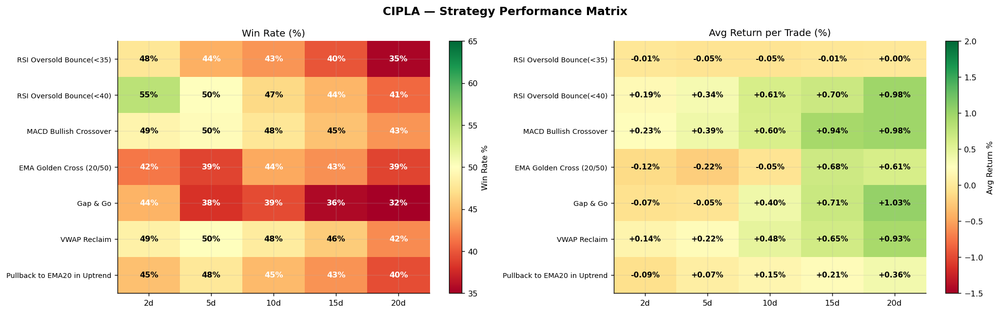
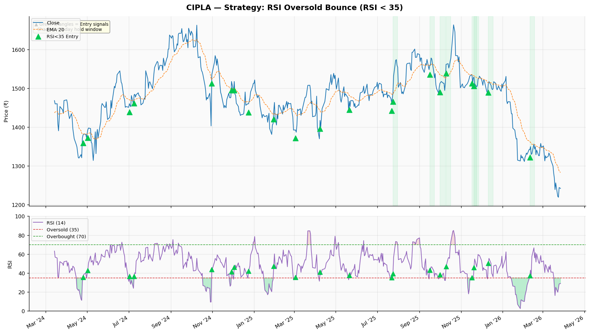
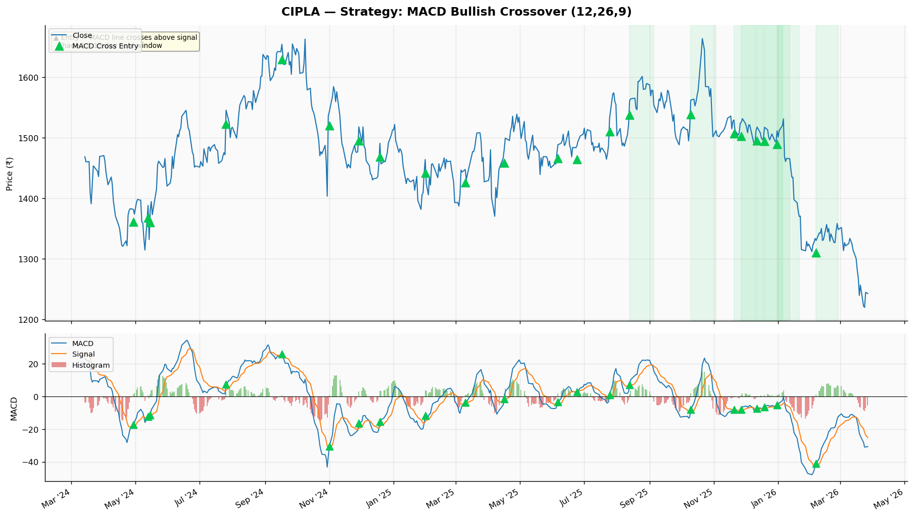
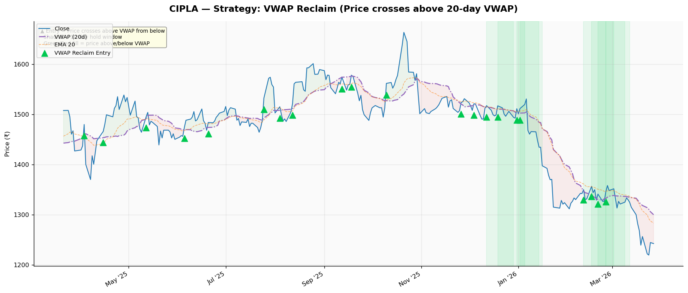

---

*Deep analysis completed | Backtesting covers 30 years (1996–2026) across 7 strategies and 5 holding periods.*
*Past performance does not guarantee future results. Always use proper position sizing and stop losses when trading.*
