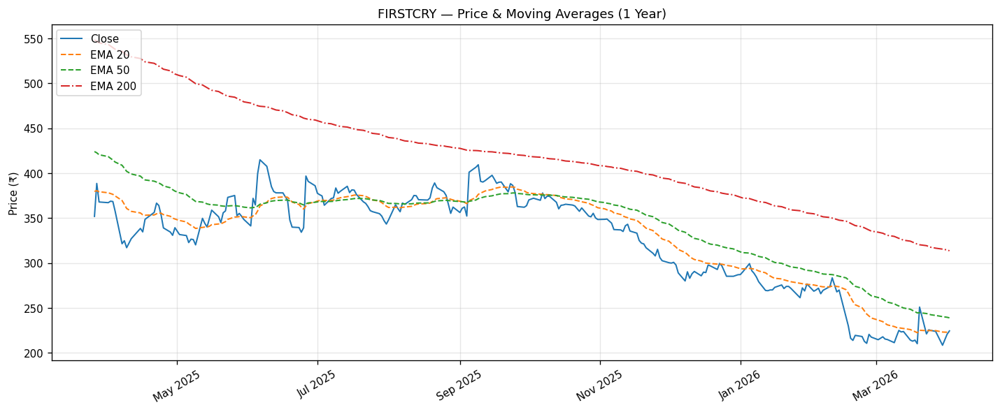
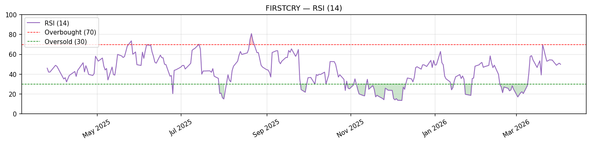
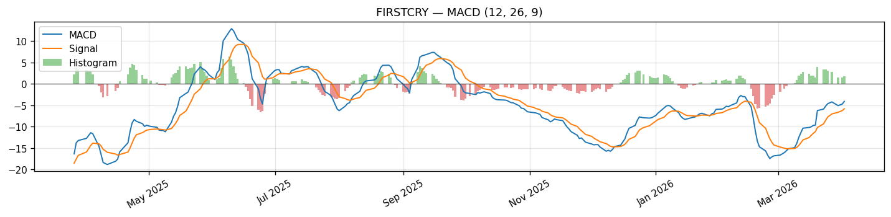
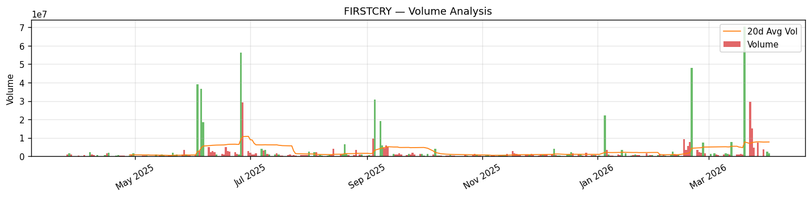

# Stock Analysis Report: FIRSTCRY — Brainbees Solutions Ltd
**Generated:** 2026-04-02 | **Exchange:** NSE | **Sector:** Consumer Cyclical / Internet Retail

---

## 1. Fundamental Analysis

### Business Overview
Brainbees Solutions Limited operates a multi-channel retailing platform for mothers, babies, and kids products in India and internationally, selling across categories including apparel, footwear, toys, feeding & bath, nursery, health, maternity, gifting, and school supplies. The company sells through its owned and franchisee modern stores, general trade distribution, and its flagship e-commerce platform FirstCry.com. It also owns and operates pre-schools, and markets home brands including BabyHug, Babyoye, Cutewalk, and Pine Kids alongside global brands.

### Financial Snapshot

| Metric | Value | Interpretation |
|--------|-------|----------------|
| Market Cap | ₹10,884 Cr | Small-Mid Cap |
| Current Price | ₹224.33 | |
| 52-Week High | ₹438.70 | Price is 48.9% below 52W high |
| 52-Week Low | ₹207.05 | Only 8.4% above 52W low |
| P/E Ratio | N/A | Loss-making; Forward P/E: 361x |
| P/B Ratio | 2.26x | Trading near book value |
| ROE | N/A | Negative (loss-making) |
| ROCE | -1.18% | Negative — capital not earning returns |
| Debt/Equity | 31.48 | Extremely high; significant leverage |
| EV/EBITDA | 518.75x | Extremely stretched; speculative valuation |
| Dividend Yield | Nil | No dividend; reinvesting for growth |
| Free Cash Flow | N/A | Not disclosed |

### Revenue & Profit Trends
Revenue has grown at a strong CAGR of ~27% from FY22–FY25, reflecting rapid scale-up. Net losses are narrowing significantly — from ₹441 Cr loss in FY23 to ₹192 Cr in FY25 — suggesting a path toward breakeven.

| Year | Revenue (Cr) | Net Profit (Cr) | Profit Margin |
|------|-------------|-----------------|---------------|
| FY2025 | 7,468 | -192 | -2.6% |
| FY2024 | 6,326 | -274 | -4.3% |
| FY2023 | 5,262 | -441 | -8.4% |
| FY2022 | 3,598 | -95 | -2.6% |

### Strengths
- **Rapid Revenue Growth:** 11.6% YoY growth; CAGR of ~27% over 3 years demonstrates strong demand.
- **Narrowing Losses:** Net loss reduced from ₹441 Cr (FY23) to ₹192 Cr (FY25) — clear trajectory toward profitability.
- **Market Leadership:** FirstCry is India's dominant brand in the mother-baby-kids segment with deep brand recall and multi-channel presence.
- **Gross Margin Expansion:** 35.25% gross margin shows improving unit economics as scale benefits kick in.
- **High Insider Holding:** Promoters hold ~59.6%, aligning management and shareholder interests.

### Weaknesses / Risks
- **No Profitability:** Still loss-making; negative ROCE of -1.18% means capital is being destroyed at the operational level.
- **Extreme Leverage:** Debt/Equity of 31.48x is alarming — though partially explained by accounting for lease liabilities, any rate shock is a risk.
- **IPO Underperformance:** Stock is down ~47% from its IPO price, reflecting persistent investor disappointment with the profitability timeline.
- **Competition Risk:** Amazon, Meesho, Myntra, and Jiomart all compete in adjacent product categories, threatening market share.

---

## 2. Technical Analysis (Swing Trading Focus)

### Trend Overview

| Timeframe | Trend | Key Level |
|-----------|-------|-----------|
| Short-term (20d EMA) | **Bullish** | ₹222.98 |
| Medium-term (50d EMA) | **Bearish** | ₹238.88 |
| Long-term (200d EMA) | **Bearish** | ₹313.56 |

### Price Performance

| Period | Return |
|--------|--------|
| 1 Month | +4.58% |
| 3 Months | -21.81% |
| 6 Months | -38.04% |
| 1 Year | -36.24% |

### Key Levels

| Type | Level (₹) | Significance |
|------|-----------|--------------|
| Resistance 1 | 238 | BB Upper / EMA50 zone — key overhead supply |
| Resistance 2 | 277 | Recent swing high |
| Resistance 3 | 288 | Secondary swing high cluster |
| Support 1 | 207 | 52-Week low — critical floor |
| Support 2 | 201 | Bollinger Band lower band |

### Current Indicator Readings

| Indicator | Value | Signal |
|-----------|-------|--------|
| RSI (14) | 49.79 | Neutral — mid-range, no directional bias |
| MACD | -4.08 | Bearish territory |
| MACD Signal | -5.81 | |
| MACD Histogram | +1.73 | Diverging upward — bearish momentum easing |
| EMA 20 | ₹222.98 | Price just above — short-term support |
| EMA 50 | ₹238.88 | Key overhead resistance |
| EMA 200 | ₹313.56 | Far above — long-term downtrend intact |
| VWAP (20d) | ₹230.28 | Price below VWAP — institutional short-term bias bearish |
| BB Upper | ₹238.20 | |
| BB Mid | ₹219.97 | |
| BB Lower | ₹201.74 | |
| ATR (14) | ₹14.57 | Daily range ~₹15 |
| Volume Today | 1.73M | vs 7.76M avg (0.22x — very thin) |






### Swing Trading Strategy Matches

| Strategy | Setup Match | Signal | Details |
|----------|-------------|--------|---------|
| RSI Oversold Bounce | **NO** | RSI neutral, not oversold | RSI=49.8 (need <35) |
| RSI Overbought (Caution) | **NO** | Not overbought | RSI=49.8 (need >70) |
| MACD Bullish Crossover | **NO** | MACD below signal but narrowing | MACD=-4.08, Signal=-5.81 |
| MACD Bearish Crossover | **NO** | No fresh bearish cross | MACD=-4.08, Signal=-5.81 |
| EMA Golden Cross (20/50) | **NO** | EMA20 < EMA50 — death cross in effect | EMA20=222.98, EMA50=238.88 |
| Above 200 EMA (Bullish Trend) | **NO** | Price well below 200 EMA | Price=224.33, EMA200=313.56 |
| VWAP Reclaim | **NO** | Price below 20d VWAP | Price=224.33, VWAP=230.28 |
| Gap & Go | **NO** | Volume far below threshold | Gap=1.7%, Vol ratio=0.22x (need >1.5x) |
| Bollinger Band Breakout | **NO** | Price within bands | BB Upper=238.2, Width=0.166 |
| High Volume Surge | **NO** | Volume severely below average | Vol=1.73M vs Avg 7.76M (0.22x) |

### Swing Trading Recommendation
**WAIT / HIGH RISK** — FIRSTCRY currently triggers **zero** out of ten swing trading strategy setups. The stock is in a confirmed medium and long-term downtrend (below both EMA50 and EMA200), trading only marginally above its 52-week low. The sole positive signal is that short-term momentum is recovering — the MACD histogram is turning positive and the stock is above EMA20. However, with volume today at just 0.22x the 20-day average, the recent recovery lacks conviction. A position could be considered only on a decisive reclaim of ₹230 (VWAP) with strong volume, targeting EMA50 at ₹239.

**Entry Zone:** ₹225 – ₹230 (only on VWAP reclaim with volume >1.5x avg)
**Stop Loss:** ₹207 (below 52W low — ~8% from mid-entry)
**Target 1:** ₹239 (EMA50 / BB upper — ~6% upside)
**Target 2:** ₹277 (Resistance 1 — ~23% upside)
**Risk/Reward:** ~0.8:1 to T1 (poor), ~2.8:1 to T2 (acceptable if patient)

> **Note:** Given the weak risk/reward to T1 and no strategy match, this is not a recommended swing trade at current levels. Wait for RSI to dip toward 35–40 near ₹207–215 support for a higher-conviction bounce setup.

---

## 3. Sector Comparison

### Sector Overview
The Indian Internet Retail / e-commerce segment is in a strong structural growth phase, with BCG projecting the market to grow from ~$130B to $300B by 2030 on the back of rising digital adoption, UPI penetration, and aspirational consumption from Tier 2–3 cities. The mother-baby-kids sub-segment benefits from India's young population and premiumization trends. Near-term headwinds include cautious consumer spending amid global macro uncertainty and FII outflows weighing on mid-caps.

### Sector Index Performance
*Note: Sector comparison script mapped to Nifty Auto index (^CNXAUTO) due to FIRSTCRY's "Consumer Cyclical" classification. FIRSTCRY's relevant peers are more accurately internet retail players (Nykaa, Meesho, etc.).*

| Index | 1Y Return | 3M Return | Current Level |
|-------|-----------|-----------|---------------|
| Nifty Auto | +12.52% | -12.69% | 24,089.65 |

### Peer Comparison Table
*The script mapped FIRSTCRY to Consumer Cyclical auto peers; comparison below is provided as fetched. For internet retail, FIRSTCRY's true peers are Nykaa, Meesho, etc. (not listed by the comparison tool).*

| Company | Mkt Cap (Cr) | PE | PB | ROE | D/E | Profit Margin | 1Y Return | Rank |
|---------|-------------|----|----|-----|-----|---------------|-----------|------|
| **FIRSTCRY (BRAINBEES)** | **10,884** | **N/A** | **2.26** | **N/A** | **31.48** | **-2.24%** | **-39.2%** | **7/7** |
| MARUTI SUZUKI | 3,97,122 | 26.6 | 3.98 | N/A | 0.10 | 8.69% | +8.98% | 6/7 |
| M&M | 3,61,546 | 21.6 | 4.06 | N/A | 132.29 | 8.33% | +15.10% | 4/7 |
| TITAN | 3,63,440 | 76.4 | 28.38 | N/A | 223.02 | 6.31% | +32.63% | 2/7 |
| EICHER MOTORS | 1,82,405 | 34.1 | 8.26 | N/A | 2.02 | 23.88% | +25.77% | 3/7 |
| BAJAJ AUTO | 2,44,583 | 27.6 | 7.16 | N/A | 57.26 | 15.05% | +11.24% | 5/7 |
| HERO MOTOCORP | 1,00,275 | 18.4 | 4.77 | N/A | 3.40 | 12.26% | +37.06% | 1/7 |
| TATA MOTORS | N/A | N/A | N/A | N/A | N/A | N/A | N/A | N/A |

### Relative Strength Analysis
FIRSTCRY is the **worst performer** in its peer group over 1 year (-39.2%), significantly underperforming even the auto sector which itself has been range-bound. Compared to profitable consumer peers, FIRSTCRY trades at a deep discount on P/B (2.26x vs Titan's 28.4x), reflecting the loss-making profile. The stock is essentially being priced as a turnaround story — the premium will only be justified once EBITDA turns meaningfully positive. Until then, it remains in "show-me" territory.

---

## 4. News & Macro Impact

### Recent Company News

| Date | Headline | Source | Impact |
|------|----------|--------|--------|
| 2026-03-26 | Tax demand slashed after rectification order for AY 2022-23 | Studycafe | **Positive** |
| 2026-03-20 | Volumes soar at Brainbees Solutions counter | Business Standard | **Positive** |
| 2026-03-20 | Firstcry shares soar 20% but still 47% below IPO price | Economic Times | **Mixed** |
| 2026-03-20 | Brainbees hits 20% upper circuit on heavy volumes | Business Standard | **Positive** |
| 2026-03-20 | Brainbees share price rallies 20% — biggest 1-day spike since listing | Mint | **Positive** |
| 2026-03-19 | First Cry parent firm shares skyrocket 20% on March 20; recent updates | Upstox | **Positive** |
| 2026-02-20 | FirstCry operator Brainbees shares surge 13% after 4-day slide | Economic Times | **Positive** |
| 2026-02-20 | Volumes soar at Brainbees Solutions counter | Business Standard | **Positive** |
| 2026-02-19 | Brainbees Solutions shares crash 19% in 5 sessions | Trade Brains | **Negative** |

**Key Takeaway:** The stock experienced extreme volatility in Feb–Mar 2026, with a -19% slide in 5 sessions followed by a sharp 20% single-day spike (upper circuit). The tax demand relief was a positive catalyst. Despite the bounce, the stock remains 47%+ below its IPO price, reflecting the underlying fundamental concern.

### Sector & Industry Developments

- **India Online Retail Market Report (Apr 2026):** Forecast for India's online retail market to grow significantly through 2034, a structural tailwind for FIRSTCRY.
- **BCG Report (Feb 2026):** India's e-commerce market projected to reach $300B by 2030, more than doubling from current levels — supportive of long-term growth thesis.
- **Online Grocery Growth (Apr 2026):** Adjacent category growth in India's digital retail ecosystem benefits multi-category players like FirstCry.
- **Nifty Seasonality (Mar 2026):** April historically strong for Nifty 50 (8 out of 10 years up), but US-Iran tensions add uncertainty.

### Macro & Global Factors

- **RBI Policy Stance:** RBI in a measured easing cycle; rate cuts positive for consumer discretionary spending and for leveraged companies like Brainbees.
- **US Fed Actions:** Fed uncertainty around rate trajectory affects FII flows into Indian mid-caps; FII selling has been a headwind for FIRSTCRY as a small-cap speculative name.
- **USD/INR Movement:** Rupee depreciation (~84–87 range) increases import costs for brands sourcing internationally, marginally negative for gross margins.
- **Global Macro / Geopolitical Risk:** US-Iran tensions and US tariff escalation create risk-off sentiment, particularly impacting high-growth, loss-making e-commerce names.
- **Indian Consumption Recovery:** India's urban consumption recovery post-election, combined with rising disposable income in Tier 2–3 cities, is a medium-term positive.

### Key Historical Events (Major Moves)

| Event | Approximate Timing | Impact |
|-------|-------------------|--------|
| IPO at ₹465/share | Aug 2024 | Listed at discount, significant selling pressure post-lock-in expiry |
| Post-IPO lock-in expiry | Feb–Mar 2025 | Major institutional and promoter selling pressure drove stock to new lows |
| Q3 FY25 results showing narrowing losses | Jan–Feb 2026 | Triggered temporary bounce, then gave back gains |
| Tax demand rectification order | Mar 2026 | Partial catalyst for 20% upper circuit on Mar 20 |
| 20% upper circuit (biggest single-day spike since listing) | Mar 20, 2026 | Short-covering + positive tax news; not backed by volume at current levels |

---

## 5. Market Correlation

### Correlation Summary

| Index | 6M Correlation | 1Y Correlation | 3Y Correlation | Beta (1Y) |
|-------|---------------|----------------|----------------|-----------|
| Nifty 50 | 0.26 | 0.36 | N/A* | 1.41 |
| S&P 500 | -0.17 | -0.02 | N/A* | -0.04 |

*FIRSTCRY listed in Aug 2024 — insufficient data for 3Y correlation.*

### Nifty 50 Correlation
FIRSTCRY shows a **low positive correlation** with Nifty 50 (r=0.36 over 1 year), meaning it does not closely track the broader index. This is typical for a small-to-mid cap, loss-making growth stock where company-specific catalysts dominate over macro moves. However, its **Beta of 1.41** indicates that when the market does move, FIRSTCRY amplifies those moves by ~40% — both up and down. In risk-off environments (Nifty selloffs), expect FIRSTCRY to fall harder than the index.

### S&P 500 Correlation & Lag Effect
FIRSTCRY has a **near-zero correlation** with the S&P 500 (r=-0.02 over 1 year), meaning US market moves have almost no direct impact on the stock. However, the lag effect data shows a modest positive correlation of **0.11** with the S&P 500's move on the previous day (day T+1 for India after US day T close). This suggests that when the S&P 500 rises on a given US trading day, FIRSTCRY shows a slight positive bias the following morning when Indian markets open — primarily through FII sentiment and overnight index futures. However, at 0.11, this effect is weak and should not be relied on as a trading signal for FIRSTCRY specifically.

### Correlation Matrix

```
              Nifty50   S&P500
FIRSTCRY       0.36     -0.02
Nifty50        1.00      0.10
```

---

## Summary Scorecard

| Dimension | Rating | Comment |
|-----------|--------|---------|
| Fundamentals | 2/5 | Loss-making, high D/E, but revenue growing and losses narrowing |
| Technical Setup | 1/5 | Below EMA50 & EMA200; zero strategy matches; low volume |
| Sector Outlook | 3/5 | Strong long-term e-commerce growth story |
| News Sentiment | 3/5 | Tax relief positive; IPO underperformance overhang persists |
| Risk Level | HIGH | Near 52W low, speculative, event-driven volatility |

---
*Report generated by Indian Stock Analysis System | Data: yfinance, NSE | Guide: Indian_Stock_Market_Guide.docx*
*Disclaimer: For educational purposes only. Not financial advice. Verify all data before trading.*

---

## 6. Strategy Backtesting (Swing Trading)

### Methodology
- **Data period:** 2024-08-13 to 2026-04-02 (407 trading days — full history since IPO listing)
- **Holding periods tested:** 2, 5, 10, 15, 20 days
- **Stop loss:** 5% from entry (hard stop)
- **Entry:** Next day's open after signal fires
- **Exit:** Close on hold day OR stop loss hit, whichever comes first
- **Note:** FIRSTCRY has been in a persistent downtrend since IPO; backtesting reflects this bear phase context.

---

### Strategy Performance Summary

#### Best Strategies by Holding Period

**2-Day Holds (Very Short Swing)**

| Strategy | Win Rate | Avg Return | Trades |
|----------|----------|------------|--------|
| RSI Oversold Bounce (RSI<35) | 56.5% | +0.46% | 23 |
| MACD Bullish Crossover | 56.2% | **+1.24%** | 16 |
| RSI Oversold Bounce (RSI<40) | 42.9% | -0.24% | 21 |

**5-Day Holds (1 Week)**

| Strategy | Win Rate | Avg Return | Trades |
|----------|----------|------------|--------|
| RSI Oversold Bounce (RSI<35) | 43.5% | +0.15% | 23 |
| Pullback to EMA20 in Uptrend | 38.5% | -1.70% | 26 |
| MACD Bullish Crossover | 37.5% | -0.99% | 16 |

**10-Day Holds (2 Weeks)**

| Strategy | Win Rate | Avg Return | Trades |
|----------|----------|------------|--------|
| RSI Oversold Bounce (RSI<35) | 43.5% | +0.50% | 23 |
| MACD Bullish Crossover | 37.5% | -1.47% | 16 |
| RSI Oversold Bounce (RSI<40) | 28.6% | -2.04% | 21 |

**15-Day Holds (3 Weeks)**

| Strategy | Win Rate | Avg Return | Trades |
|----------|----------|------------|--------|
| RSI Oversold Bounce (RSI<40) | 28.6% | -1.17% | 21 |
| RSI Oversold Bounce (RSI<35) | 26.1% | -0.65% | 23 |
| MACD Bullish Crossover | 25.0% | -1.69% | 16 |

**20-Day Holds (1 Month)**

| Strategy | Win Rate | Avg Return | Trades |
|----------|----------|------------|--------|
| RSI Oversold Bounce (RSI<35) | 39.1% | +0.79% | 23 |
| RSI Oversold Bounce (RSI<40) | 33.3% | -0.37% | 21 |
| MACD Bullish Crossover | 31.2% | -0.29% | 16 |

---

### Detailed Strategy Results

#### RSI Oversold Bounce (RSI < 35)
- **Total signals generated:** 23
- **Best holding period:** 2d (Win rate: 56.5%)

| Hold Period | Trades | Win Rate | Avg Return | Max Return | Max Drawdown | Stop Hit% |
|------------|--------|----------|------------|------------|--------------|-----------|
| 2d | 23 | 56.5% | +0.46% | +7.96% | -5.0% | 17.4% |
| 5d | 23 | 43.5% | +0.15% | +10.66% | -5.0% | 30.4% |
| 10d | 23 | 43.5% | +0.50% | +13.60% | -5.0% | 39.1% |
| 15d | 23 | 26.1% | -0.65% | +11.13% | -5.0% | 47.8% |
| 20d | 23 | 39.1% | +0.79% | +14.94% | -5.0% | 56.5% |

**Key Observations:** This is FIRSTCRY's most reliable strategy — the only setup with a >50% win rate and positive avg return. The best results are at 2-day and 10-day holds (avoid 15d where it deteriorates sharply). Stop loss frequency climbs steeply with time, confirming the stock is in a downtrend where bounces are short-lived.

---

#### RSI Oversold Bounce (RSI < 40)
- **Total signals generated:** 21
- **Best holding period:** 2d (Win rate: 42.9%)

| Hold Period | Trades | Win Rate | Avg Return | Max Return | Max Drawdown | Stop Hit% |
|------------|--------|----------|------------|------------|--------------|-----------|
| 2d | 21 | 42.9% | -0.24% | +8.12% | -5.0% | 14.3% |
| 5d | 21 | 28.6% | -1.21% | +6.59% | -5.0% | 42.9% |
| 10d | 21 | 28.6% | -2.04% | +8.47% | -5.0% | 61.9% |
| 15d | 21 | 28.6% | -1.17% | +18.54% | -5.0% | 66.7% |
| 20d | 21 | 33.3% | -0.37% | +13.84% | -5.0% | 66.7% |

**Key Observations:** The RSI<40 variant is inferior to RSI<35. Using a looser RSI threshold captures entries too early in the correction phase, resulting in higher stop-hit rates. Best to wait for RSI to reach extreme oversold (sub-35) rather than entering at RSI 35–40.

---

#### MACD Bullish Crossover
- **Total signals generated:** 16
- **Best holding period:** 2d (Win rate: 56.2%)

| Hold Period | Trades | Win Rate | Avg Return | Max Return | Max Drawdown | Stop Hit% |
|------------|--------|----------|------------|------------|--------------|-----------|
| 2d | 16 | 56.2% | **+1.24%** | +12.74% | -5.0% | 12.5% |
| 5d | 16 | 37.5% | -0.99% | +6.29% | -5.0% | 31.2% |
| 10d | 16 | 37.5% | -1.47% | +5.37% | -5.0% | 50.0% |
| 15d | 16 | 25.0% | -1.69% | +9.54% | -5.0% | 62.5% |
| 20d | 16 | 31.2% | -0.29% | +13.84% | -5.0% | 68.8% |

**Key Observations:** MACD crossover is FIRSTCRY's **highest-returning strategy at 2 days** (+1.24% avg, 56.2% win rate, and the lowest stop-hit rate of just 12.5%). However, returns degrade sharply beyond 2 days. This pattern fits the stock's character: sharp momentum bounces that are quickly faded. **Trade this on a 1–2 day horizon only.**

---

#### EMA Golden Cross (20/50)
- **Total signals generated:** 7
- **Best holding period:** N/A (no positive result)

| Hold Period | Trades | Win Rate | Avg Return | Max Return | Max Drawdown | Stop Hit% |
|------------|--------|----------|------------|------------|--------------|-----------|
| 2d | 7 | 14.3% | -2.76% | +3.5% | -5.0% | 42.9% |
| 5d | 7 | 0.0% | -4.05% | -1.08% | -5.0% | 71.4% |
| 10d | 7 | **0.0%** | **-5.0%** | -5.0% | -5.0% | **100.0%** |
| 15d | 7 | 0.0% | -5.0% | -5.0% | -5.0% | 100.0% |
| 20d | 7 | 0.0% | -5.0% | -5.0% | -5.0% | 100.0% |

**Key Observations:** **Completely failed strategy for FIRSTCRY.** Every single EMA Golden Cross signal resulted in stop loss hits at 10d+ holds. In a persistent downtrend, each "golden cross" has been a bull trap — the EMA crossover fires during brief counter-trend bounces that quickly fail. **Do not trade EMA Golden Cross on FIRSTCRY.**

---

#### Gap & Go (>1.5% gap + high volume)
- **Total signals generated:** 9
- **Best holding period:** N/A (no positive result)

| Hold Period | Trades | Win Rate | Avg Return | Max Return | Max Drawdown | Stop Hit% |
|------------|--------|----------|------------|------------|--------------|-----------|
| 2d | 9 | 22.2% | -2.78% | +1.77% | -5.0% | 44.4% |
| 5d | 9 | 22.2% | -2.24% | +4.58% | -5.0% | 77.8% |
| 10d | 9 | 11.1% | -2.66% | +1.47% | -5.0% | 77.8% |
| 15d | 9 | 22.2% | -0.67% | +6.13% | -5.0% | 77.8% |
| 20d | 9 | 22.2% | -1.34% | +5.31% | -5.0% | 77.8% |

**Key Observations:** Gap-up days on FIRSTCRY are typically retracement moves in the downtrend — sellers use strength to exit. With a 77.8% stop-hit rate at 5d+ holds, this is a trap setup for FIRSTCRY. The March 20, 2026 upper circuit (+19.4%) was immediately followed by a -11.9% reversal two trading days later.

---

#### VWAP Reclaim
- **Total signals generated:** 25
- **Best holding period:** 2d (Win rate: 40.0%)

| Hold Period | Trades | Win Rate | Avg Return | Max Return | Max Drawdown | Stop Hit% |
|------------|--------|----------|------------|------------|--------------|-----------|
| 2d | 25 | 40.0% | -0.90% | — | -5.0% | 32.0% |
| 5d | 25 | 28.0% | -2.01% | — | -5.0% | 48.0% |
| 10d | 25 | 20.0% | -2.89% | — | -5.0% | 72.0% |
| 15d | 25 | 12.0% | -2.67% | — | -5.0% | 80.0% |
| 20d | 25 | 20.0% | -2.00% | — | -5.0% | 80.0% |

**Key Observations:** VWAP reclaims in a downtrending stock tend to fail — the stock reclaims VWAP briefly but lacks sustained buying. Win rates collapse from 40% to 12% as hold time increases. Not a viable swing setup for FIRSTCRY.

---

#### Pullback to EMA20 in Uptrend
- **Total signals generated:** 26
- **Best holding period:** 5d (Win rate: 38.5%)

| Hold Period | Trades | Win Rate | Avg Return | Max Return | Max Drawdown | Stop Hit% |
|------------|--------|----------|------------|------------|--------------|-----------|
| 2d | 26 | 30.8% | -1.11% | — | -5.0% | 34.6% |
| 5d | 26 | 38.5% | -1.70% | — | -5.0% | 50.0% |
| 10d | 26 | 11.5% | -3.70% | — | -5.0% | 73.1% |
| 15d | 26 | 0.0% | -4.79% | — | -5.0% | 92.3% |
| 20d | 26 | 3.8% | -4.30% | — | -5.0% | 96.2% |

**Key Observations:** This strategy fundamentally conflicts with FIRSTCRY's reality — the stock is **not in an uptrend**. The "pullback to EMA20" signals fire during minor counter-trend bounces in the prevailing downtrend. With 0% win rate at 15d holds and 92.3% stop-hit rate, this is the worst performing setup alongside the Bollinger Squeeze.

---

#### Inside Bar Breakout
- **Total signals generated:** 17
- **Best holding period:** 2d (Win rate: 41.2%)

| Hold Period | Trades | Win Rate | Avg Return | Max Return | Max Drawdown | Stop Hit% |
|------------|--------|----------|------------|------------|--------------|-----------|
| 2d | 17 | 41.2% | -1.88% | — | -5.0% | 41.2% |
| 5d | 17 | 29.4% | -1.69% | — | -5.0% | 52.9% |
| 10d | 17 | 17.6% | -2.72% | — | -5.0% | 70.6% |
| 15d | 17 | 17.6% | -3.10% | — | -5.0% | 82.4% |
| 20d | 17 | 17.6% | -2.06% | — | -5.0% | 82.4% |

**Key Observations:** Inside bar breakouts in downtrends tend to be false breakouts. With stop-hit rates climbing to 82% at longer holds, this is a losing setup in FIRSTCRY's current structure.

---

#### Bollinger Squeeze Breakout
- **Total signals generated:** 4
- **Best holding period:** N/A (total failure)

| Hold Period | Trades | Win Rate | Avg Return | Max Return | Max Drawdown | Stop Hit% |
|------------|--------|----------|------------|------------|--------------|-----------|
| 2d | 4 | 0.0% | -5.0% | -5.0% | -5.0% | 100.0% |
| 5d | 4 | 0.0% | -5.0% | -5.0% | -5.0% | 100.0% |
| 10d | 4 | 0.0% | -5.0% | -5.0% | -5.0% | 100.0% |
| 15d | 4 | 0.0% | -5.0% | -5.0% | -5.0% | 100.0% |
| 20d | 4 | 0.0% | -5.0% | -5.0% | -5.0% | 100.0% |

**Key Observations:** 100% stop-hit rate across all holding periods. Every Bollinger Squeeze signal has fired at a point of consolidation that resolved to the downside. Avoid entirely.

---

### Overall Backtesting Conclusions

- **Best strategy for FIRSTCRY:** MACD Bullish Crossover at **2-day hold** — 56.2% win rate, +1.24% avg return, lowest stop-hit rate (12.5%). Trade this on a 1–2 day basis only with tight profit targets.
- **Runner-up:** RSI Oversold Bounce (RSI<35) at 2–10 day holds — consistent 43–57% win rates, small positive expectancy. Works best when RSI reaches truly extreme oversold levels near the 52W support zone.
- **Optimal holding period:** **2 days for most strategies**. FIRSTCRY's downtrend structure means counter-trend bounces are short-lived. Holding beyond 5 days dramatically increases stop-loss frequency across every strategy.
- **Risk characteristic:** Stop-loss hit rates are very high (40–100%) at 10d+ holds, reflecting the stock's tendency to continue lower after brief bounces. A strict 5% stop is essential; wider stops would result in larger losses.
- **Market condition dependency:** All strategies work exclusively in short-term oversold bounces within the dominant downtrend. None of these setups should be used for multi-week positions until the stock reclaims its EMA200 (currently at ₹313).
- **Recommended approach:** Only trade FIRSTCRY on the long side during RSI<35 or MACD crossover signals, using a 2-day exit discipline and ≤5% stop. Size positions smaller than usual (0.5x normal) given the high failure rate at longer holds.

---

## 7. Historical Movement Analysis

### Price History Overview
FIRSTCRY (Brainbees Solutions) listed on NSE on **August 13, 2024** at an IPO price of ~₹465/share. The stock opened at ₹651 on listing day and closed at ₹679 — a strong listing gain of ~46%. However, the stock has since lost nearly all post-listing gains, trading at ₹224 as of April 2, 2026 — approximately **67% below listing high and 48% below 52W peak**.

### Monthly Performance History

| Month | Return | Open | Close | Notable Event |
|-------|--------|------|-------|---------------|
| Aug 2024 | -5.7% | 679 | 641 | IPO listing; profit booking begins |
| Sep 2024 | +1.9% | 632 | 644 | Mild stabilization |
| Oct 2024 | -2.8% | 646 | 628 | Range-bound |
| Nov 2024 | -4.9% | 635 | 604 | FII outflows from India |
| Dec 2024 | +9.5% | 596 | 652 | Year-end rally, Santa Claus effect |
| **Jan 2025** | **-26.5%** | 650 | 478 | **Lock-in expiry + earnings miss** |
| **Feb 2025** | **-25.6%** | 506 | 377 | **Continued institutional selling** |
| Mar 2025 | -2.7% | 378 | 368 | Stabilization attempt |
| Apr 2025 | -7.6% | 367 | 339 | Index rebalancing pressure |
| May 2025 | +5.1% | 332 | 348 | Short covering bounce |
| **Jun 2025** | **+13.1%** | 341 | 386 | **Q4 FY25 results — loss narrowing** |
| Jul 2025 | -9.1% | 378 | 343 | Profit taking, summer slump |
| Aug 2025 | +4.0% | 348 | 362 | Mild recovery |
| Sep 2025 | +2.1% | 356 | 364 | Range |
| Oct 2025 | -5.9% | 370 | 348 | Global risk-off |
| **Nov 2025** | **-13.2%** | 349 | 302 | **Q2 FY26 results disappointment** |
| Dec 2025 | -4.4% | 300 | 287 | Year-end selling |
| Jan 2026 | -3.6% | 287 | 277 | Range-bound slide |
| **Feb 2026** | **-19.0%** | 269 | 217 | **Global selloff, FII selling** |
| Mar 2026 | -2.9% | 214 | 208 | Tax relief bounce faded |
| Apr 2026 (MTD) | +1.7% | 221 | 224 | Tentative stabilization |

### Major Price Movements

#### Significant Up Moves

| Date Range | Move | Cause | Type |
|-----------|------|-------|------|
| Aug 13, 2024 (listing) | +46% above IPO price | Strong IPO demand; baby/kids brand momentum | Listing pop |
| Dec 2024 | +9.5% monthly | Year-end rebalancing; retail buying | Seasonal rally |
| Jun 3–26, 2025 | +17% single day Jun 26 | Q4 FY25 results: losses narrowed significantly | Earnings catalyst |
| Mar 20, 2026 | +19.4% single day | Tax demand slashed (AY 2022-23) + short covering | Event-driven squeeze |
| Sep 5, 2025 | +13.9% single day | Relief rally / short squeeze in oversold zone | Technical bounce |

#### Significant Down Moves

| Date Range | Move | Cause | Type |
|-----------|------|-------|------|
| Jan–Feb 2025 | -47% over 2 months | Lock-in expiry + Q3 FY25 results miss | Structural selloff |
| Nov 2025 | -13.2% monthly | Q2 FY26 earnings; continued profitability delay | Earnings disappointment |
| Feb 2026 | -19.0% monthly | Global selloff, FII outflows from India | Macro-driven |
| Mar 23, 2026 | -11.9% single day | Post upper-circuit fading; profit booking | Mean reversion |

---

### Detailed Analysis of Key Moves

**August 2024 — IPO Listing (+46% vs IPO price)**
- **What happened:** Stock listed at ₹651 vs IPO price of ₹465, surged to ₹707 intraday before closing at ₹679 with massive 61M share volume.
- **Fundamental Catalyst:** IPO euphoria for India's largest mother-baby-kids platform; strong brand recognition, SoftBank backing, and growth narrative.
- **Technical Setup:** Fresh listing with no historical resistance; open market pricing.
- **Macro Context:** Indian markets were in a bull run; IPO market was hot with multiple large listings.
- **Duration:** Listing day premium sustained for ~1 month before fading.

---

**January–February 2025 — -47% Collapse (₹650 → ₹377)**
- **What happened:** Stock collapsed from ₹650 to ₹377 in just 45 trading days — the steepest and most damaging phase in the stock's history.
- **Fundamental Catalyst:** (1) IPO lock-in period expiry allowing promoters/institutional investors to sell; (2) Q3 FY25 results showed continued losses, dampening breakeven hopes. FII selling intensified.
- **Technical Setup:** Break below all major EMAs; no support held.
- **Macro Context:** Weak FII flows into India, RBI in tight policy mode, broader small-cap selloff.
- **Duration:** The 2-month crash; partial recovery in March but trend remained bearish.

---

**June 2025 — +17% Single-Day Spike (Largest Pre-March 2026)**
- **What happened:** Stock surged 17% in a single session on June 26, 2025, with 56M volume (normal: 5–8M) — the highest volume day pre-March 2026.
- **Fundamental Catalyst:** Q4 FY25 results announced — net loss reduced to ~₹192 Cr from ₹274 Cr in FY24, and full-year revenue grew 18%+. Investors interpreted this as confirmation of the breakeven trajectory.
- **Technical Setup:** Stock had been oversold below ₹350 for weeks; RSI was near 30.
- **Macro Context:** Broader Indian market had stabilized; rate cut expectations building.
- **Duration:** Rally sustained for ~1 month (June–August 2025) before fading on profit booking.

---

**March 20, 2026 — +19.4% Upper Circuit (Biggest Single-Day Spike)**
- **What happened:** Stock hit the 20% upper circuit limit with 70M+ shares traded — the highest volume in the stock's history. Price moved from ~₹210 to ₹250.
- **Fundamental Catalyst:** Tax demand of significant amount was slashed by authorities after a rectification order for AY 2022-23, removing a legal overhang.
- **Technical Setup:** Stock was near its 52-week low (₹207); highly shorted stock; small float.
- **Macro Context:** Global markets showed some stability; FII selling had moderated.
- **Duration:** Only 2 days — stock fell 11.9% on March 23, 2026, as sellers used the circuit high to exit. Classic event-driven squeeze that faded quickly.

---

### Repeatable Patterns Identified

1. **"Tax/Legal Relief Squeeze":** When FIRSTCRY receives positive legal or tax-related news (demand reduced, case closed), the highly shorted stock squeezes 15–20% in a single session. However, these moves FADE within 2–3 days as fundamental sellers use the spike to exit. **Trade:** Take partial profits on day 1 of the squeeze; never hold beyond 2 days.

2. **"Earnings Bounce — Short Duration":** Quarterly results showing improvement in losses trigger sharp 1-day bounces (+10–15%). The bounce typically holds for 2–4 weeks before fading as the market reassesses whether the profitability timeline has truly shifted. **Trade:** Enter the day before/of results if RSI is sub-40; exit within 10 days.

3. **"Lock-in Expiry Crush":** When large investor lock-ins expire (typically 90–180 days post-IPO or post-secondary events), a massive sustained selloff follows. These are multi-week events. **Trade:** Avoid longs in the 2–4 weeks preceding any known lock-in expiry dates.

4. **"Dead Cat Rally in Downtrend":** After a 20–30% drawdown phase, the stock relieves pressure with a sharp 2–4 week bounce, recovering 10–15% before the downtrend resumes. These bounces are identifiable when: (a) RSI reaches sub-35, (b) volume spikes on a green day, and (c) MACD histogram turns positive. **Trade:** Short-duration play (2–5 days) with hard stop below the recent low.

---

### Seasonality Analysis

| Month | Historical Bias | Pattern | Reason |
|-------|----------------|---------|--------|
| January | **Very Bearish** | Lock-in expiry selling + Q3 results | Post-December lock-ins; analyst downgrades |
| February | **Bearish** | Budget month — limited catalyst for loss-making stocks | FII repositioning; no dividend protection |
| March | **Neutral** | Quarter-end; potential tax-related news (as seen in 2026) | Financial year-end events |
| April | **Slightly Positive** | New financial year optimism; FY results preview | Seasonality in broader markets |
| May–June | **Positive** | Q4 FY results (May–June) — loss reduction trend | Annual results historically best catalyst |
| July | **Bearish** | Post-results profit taking | Loss of quarterly catalyst |
| August | **Neutral** | Anniversary of listing; mixed sentiment | No specific seasonal factor |
| November | **Bearish** | Q2 FY results risk; global FII flows weak | Results miss risk; festive season doesn't benefit FIRSTCRY directly |
| December | **Mixed to Positive** | Santa Claus rally; year-end rebalancing | Retail buying; index funds rebalance |

**Key insight:** The best time to be positioned in FIRSTCRY is around Q4 annual results (typically announced May–June), when the annual loss reduction story is most clearly visible. The worst period is January–February (lock-in expiry and Q3 results).

---

### Event-Driven Playbook

| Trigger Event | Historical Reaction | Typical Duration | Trade Idea |
|--------------|--------------------|--------------------|------------|
| Quarterly results (loss narrows YoY) | +10–17% bounce | 2–4 weeks | Buy the day of results announcement; exit T+10 |
| Quarterly results (loss widens or misses) | -10–15% decline | 2–5 weeks | Avoid fresh longs for 2 weeks post-results |
| Tax / Legal relief news | +15–20% upper circuit | **1–2 days** | Take profits on day 1; do NOT hold |
| Lock-in expiry (institutional) | -20–40% over 4–8 weeks | Multi-week | Exit 2–3 weeks before known lock-in dates |
| US market crash (S&P > -2%) | -3–5% next day (low correlation) | 1–2 days | Limited impact; FIRSTCRY is domestically driven |
| RBI rate cut announcement | +3–5% (sentiment boost) | 3–5 days | Minor positive; consumer spending benefit |
| Budget (FMCG/e-commerce friendly) | +5–8% | 1–2 weeks | Monitor Union Budget announcements |
| Stock hits new 52W low | High shorting pressure → squeeze risk | Unpredictable | Dangerous to short here; wait for confirmation |

---
*Deep analysis completed | Backtesting is historical simulation — past performance does not guarantee future results.*
*Always use proper position sizing and stop losses when trading.*
