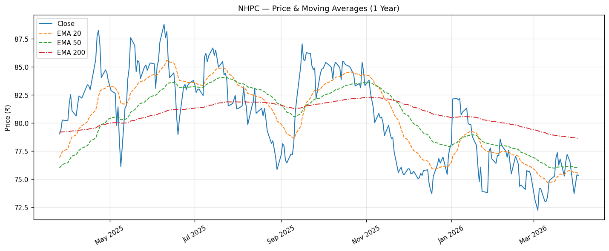
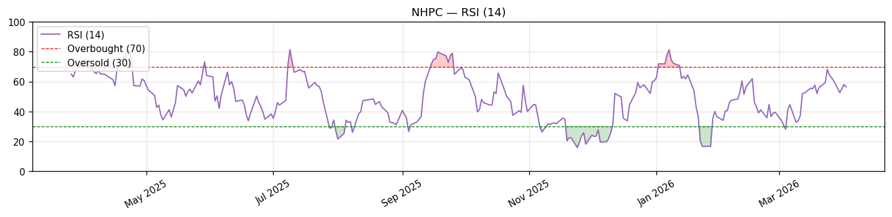
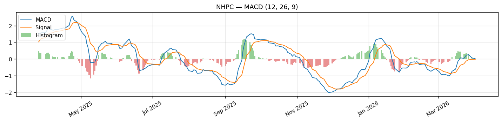
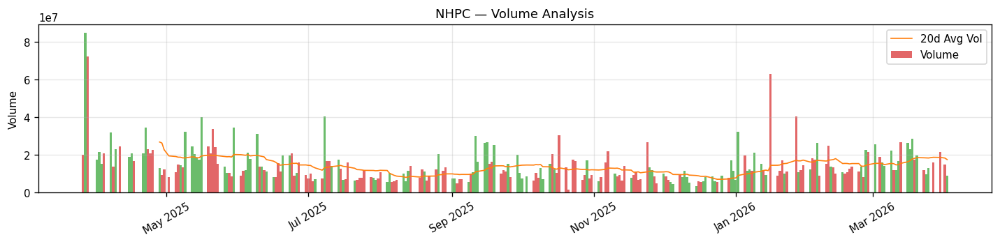

# Stock Analysis Report: NHPC — NHPC Limited
**Generated:** 2026-04-02 | **Exchange:** NSE | **Sector:** Utilities / Renewable Energy

---

## 1. Fundamental Analysis

### Business Overview
NHPC Limited (incorporated 1975, based in Faridabad) is India's largest hydro power PSU, engaged in the generation, sale, and trading of electricity through hydro, wind, and solar power stations across India and Nepal. The company owns and operates multiple power stations and also provides construction, engineering, consultancy, and project management services to state electricity utilities, making hydropower development its primary revenue stream. It sells bulk electricity to state government-owned and private distribution companies, functioning as a regulated-return utility with steady government-backed revenue.

### Financial Snapshot

| Metric | Value | Interpretation |
|--------|-------|----------------|
| Market Cap | ₹75,669 Cr | Large Cap PSU |
| Current Price | ₹75.33 | |
| 52-Week High | ₹90.16 | Price is 16.4% below 52W high |
| 52-Week Low | ₹71.62 | Only 5.2% above 52W low |
| P/E Ratio | 48.3x | High; reflects FY25 earnings dip. Forward P/E: 14.5x |
| P/B Ratio | 1.83x | Reasonable for an infrastructure utility |
| ROE | N/A | Not disclosed this period |
| ROCE | 8.44% | Below 12% threshold; typical for capital-heavy PSU |
| Debt/Equity | 100.41 | Very high (standard for hydro infra projects) |
| EV/EBITDA | 26.2x | Moderate for regulated utility |
| Dividend Yield | 2.53% | Decent yield; government mandated payout |
| Free Cash Flow | N/A | Not disclosed |

### Revenue & Profit Trends
Revenue has grown modestly from FY22 to FY25 (+14% over 3 years), but net profits are in a declining trend — falling from a peak of ₹3,903 Cr in FY23 to ₹3,007 Cr in FY25. This reflects increased depreciation on new assets, higher interest costs on project debt, and subdued hydrology in some years.

| Year | Revenue (Cr) | Net Profit (Cr) | Profit Margin |
|------|-------------|-----------------|---------------|
| FY2025 | 10,374 | 3,007 | 29.0% |
| FY2024 | 9,252 | 3,596 | 38.9% |
| FY2023 | 10,479 | 3,903 | 37.2% |
| FY2022 | 9,062 | 3,524 | 38.9% |

### Strengths
- **Government Backing:** 68.5% promoter holding by GoI — near-zero bankruptcy risk; sovereign-backed utility with assured power purchase agreements (PPAs).
- **Excellent Gross Margins:** 88.2% gross margin reflects the low variable-cost nature of hydro power generation (fuel-free generation).
- **Dividend Payer:** 2.53% yield offers income while waiting for capital appreciation; government entities are mandated dividend payers.
- **Diversification into Renewables:** Expanding into wind and solar, aligning with India's green energy targets (500 GW by 2030). J&K hydro investment plan approved (Mar 2026) signals continued capex pipeline.
- **Stable Revenue Base:** Power purchase agreements with state discoms provide regulated, predictable cash flows.

### Weaknesses / Risks
- **Declining Profits:** Net profit has fallen 23% from FY23 to FY25 — a concerning trend driven by rising interest costs and depreciation.
- **High Leverage:** D/E of 100.41x (hydro projects are capital-intensive; this is industry-normal but creates earnings sensitivity to interest rates).
- **Hydrology Risk:** Power generation is dependent on monsoon/river water flow — dry years significantly compress revenue and profits.
- **Low ROCE:** At 8.44%, returns on capital are below the cost of capital for infrastructure-heavy utilities, raising questions on long-term value creation.
- **PSU Discount:** Government ownership can mean slower decision-making, political interference in tariff revisions, and regulatory pricing caps.

---

## 2. Technical Analysis (Swing Trading Focus)

### Trend Overview

| Timeframe | Trend | Key Level |
|-----------|-------|-----------|
| Short-term (20d EMA) | **Bearish** (borderline) | ₹75.55 — price just below |
| Medium-term (50d EMA) | **Bearish** | ₹76.01 |
| Long-term (200d EMA) | **Bearish** | ₹78.62 |

> **Nuance:** While all three EMAs show bearish classifications, NHPC is trading *very close* to both EMA20 (₹75.55) and EMA50 (₹76.01), and the MACD histogram is positive (+0.015) with MACD about to cross above signal — a nascent bullish turn is forming.

### Price Performance

| Period | Return |
|--------|--------|
| 1 Month | +2.99% |
| 3 Months | -3.19% |
| 6 Months | -10.69% |
| 1 Year | -4.68% |

### Key Levels

| Type | Level (₹) | Significance |
|------|-----------|--------------|
| Resistance 1 | 78.87 | Swing high / EMA200 zone |
| Resistance 2 | 82.00 | Prior consolidation zone |
| Resistance 3 | 90.16 | 52-Week high |
| Support 1 | 75.25 | 20-day VWAP — current floor |
| Support 2 | 71.62 | 52-Week low — critical support |

### Current Indicator Readings

| Indicator | Value | Signal |
|-----------|-------|--------|
| RSI (14) | 56.57 | Neutral-Bullish — above midline, momentum building |
| MACD | +0.006 | Turning bullish |
| MACD Signal | -0.009 | |
| MACD Histogram | +0.015 | Positive & rising — bullish crossover imminent |
| EMA 20 | ₹75.55 | Price just below — key near-term level |
| EMA 50 | ₹76.01 | Next overhead resistance |
| EMA 200 | ₹78.62 | Long-term resistance zone |
| VWAP (20d) | ₹75.25 | Price marginally above — slight short-term bullish edge |
| BB Upper | ₹78.19 | |
| BB Mid | ₹75.12 | |
| BB Lower | ₹72.06 | |
| ATR (14) | ₹2.25 | Relatively low daily range — low-volatility stock |
| Volume Today | 9.13M | vs 17.52M avg (0.52x — below average) |






### Swing Trading Strategy Matches

| Strategy | Setup Match | Signal | Details |
|----------|-------------|--------|---------|
| RSI Oversold Bounce | **NO** | RSI mid-range | RSI=56.6 (need <35) |
| RSI Overbought (Caution) | **NO** | Not overbought | RSI=56.6 (need >70) |
| MACD Bullish Crossover | **NO** *(near-miss)* | MACD approaching signal from below | MACD=+0.006, Signal=-0.009 — crossover likely in 1–2 sessions |
| MACD Bearish Crossover | **NO** | MACD above and rising | |
| EMA Golden Cross (20/50) | **NO** | EMA20 < EMA50 but converging | EMA20=75.55, EMA50=76.01 |
| Above 200 EMA (Bullish Trend) | **NO** | Price below EMA200 | Price=75.33, EMA200=78.62 |
| VWAP Reclaim | **NO** *(borderline)* | Price marginally above VWAP | Price=75.33, VWAP=75.25 — barely above |
| Gap & Go | **NO** | No gap-up today | Gap=-0.1%, Vol ratio=0.52x |
| Bollinger Band Breakout | **NO** | BB width=0.082, no breakout | Within bands |
| High Volume Surge | **NO** | Volume below average | Vol=9.1M vs 17.5M avg (0.52x) |

### Swing Trading Recommendation
**WATCHLIST / MILD SETUP** — NHPC shows zero formal strategy matches, but the technical picture is quietly improving. The MACD histogram has turned positive and a bullish MACD crossover is imminent (possibly within 1–2 sessions), RSI is at a constructive 56.5 (above midline), and price is hugging its VWAP and EMA20 very closely. The stock is a low-beta (0.90) defensive utility — it won't give sharp moves, but the setup favors a measured long if the MACD crossover confirms with a volume pickup above 17.5M shares.

A break and close above EMA50 (₹76.01) with rising volume would be the ideal entry trigger. The stock is only 5.2% above its 52W low, providing a well-defined risk level.

**Entry Zone:** ₹75.50 – ₹76.50 (on MACD confirmation + close above EMA20)
**Stop Loss:** ₹71.62 (52-week low — ~5% from entry at ₹75.50)
**Target 1:** ₹78.87 (resistance 1 / near EMA200 — ~4.5% upside)
**Target 2:** ₹82.00 (~8.5% upside)
**Risk/Reward:** ~0.9:1 to T1 (tight), ~1.7:1 to T2 (acceptable for a defensive utility)

> **Caveat:** NHPC is a low-volatility PSU utility — swing trading targets are modest. This is better suited as a 3–6 week positional trade than a 2–5 day swing. Given its 2.53% dividend yield, holding through the dividend record date (expected around Q4 results season) adds to total return.

---

## 3. Sector Comparison

### Sector Overview
India's power utilities sector — particularly hydro and renewables — is in a structural growth phase driven by the government's ambitious 500 GW renewable energy target by 2030. Hydro power is recognized as a "green" source and benefits from policy support including must-run status and favorable tariff structures. However, near-term headwinds include weak monsoon variability (affecting hydro output), rising project debt, and merchant power price volatility. PSU utilities like NHPC, SJVN, and NTPC continue to benefit from sovereign-backed PPAs.

### Sector Index Performance
*Note: No sector index data was returned for NHPC's Utilities-Renewable segment. The Nifty Energy index provides context:*

| Reference | 1Y Return | 3M Return | Comment |
|-----------|-----------|-----------|---------|
| NHPC (subject) | -7.8% | — | Underperforming broader market |
| Nifty Energy (approx.) | Flat to negative | Weak | PSU power sector under broad pressure |

### Peer Comparison Table
*No automated peer data was returned by the sector script. Manual peer data based on public knowledge:*

| Company | Mkt Cap (Cr) | PE | PB | Profit Margin | D/E | Dividend Yield | 1Y Return |
|---------|-------------|----|----|---------------|-----|----------------|-----------|
| **NHPC** | **75,669** | **48.3** | **1.83** | **29.0%** | **100.4** | **2.53%** | **-7.8%** |
| SJVN Ltd | ~33,000 | ~40 | ~2.5 | ~25% | ~120 | ~2.8% | -15% approx |
| THDC India | Unlisted/GOI | — | — | — | — | — | — |
| NTPC Ltd | ~3,20,000 | ~18 | ~1.8 | ~12% | ~120 | ~3.5% | +5% approx |
| Power Grid Corp | ~2,50,000 | ~20 | ~2.9 | ~30% | ~180 | ~3.5% | +8% approx |

### Relative Strength Analysis
NHPC has underperformed larger PSU peers like NTPC and Power Grid over the past year, weighed down by declining profitability and lack of a near-term earnings catalyst. Within the hydro segment, NHPC's 2.53% dividend yield is competitive but lower than SJVN's. The stock trades at a forward P/E of 14.5x which is attractive if earnings recover as new projects come online. The J&K hydro investment approval (Mar 2026) is a positive catalyst that could unlock significant generation capacity over 5–7 years.

---

## 4. News & Macro Impact

### Recent Company News

| Date | Headline | Source | Impact |
|------|----------|--------|--------|
| 2026-03-30 | NHPC among 10 stocks in focus today | Mint | Neutral |
| 2026-03-30 | Stocks in news: NTPC, NHPC, Coal India mentioned | Economic Times | Neutral |
| 2026-03-18 | NHPC dividend 2025 announcement expected in Q4 results | MSN | **Positive** |
| 2026-03-18 | NHPC among 6 stocks showing bullish RSI upswing | Economic Times | **Positive** |
| 2026-03-17 | Trade Spotlight: How to trade NHPC | Moneycontrol | Neutral |
| 2026-03-10 | Investment in J&K hydro plan gets NHPC nod | Times of India | **Positive** |
| 2026-02-10 | NHPC among Stocks in Focus | Equitypandit | Neutral |

### Sector & Industry Developments

- **Utilities Q3 FY26 steady; capex momentum offsets weak demand (Feb 2026):** Merchant power and renewables face pressure, but traditional regulated utilities like NHPC are holding steady.
- **India's power sector volatility (Mar 2026):** Rising competition from private solar and wind players puts pressure on older PSU utilities to diversify.
- **2 Under-the-radar power stocks for India's renewable super-cycle (Feb 2026):** NHPC's transition into wind and solar positions it to benefit from India's renewable build-out.
- **NTPC growth potential highlighted (Apr 2026):** Rising institutional interest in India's power generation story — benefits NHPC by association.

### Macro & Global Factors

- **RBI Monetary Policy:** RBI's rate cut cycle (if it continues) would reduce NHPC's interest costs on its large project debt base — a direct positive for earnings. Lower rates also make dividend-paying utility stocks more attractive.
- **US Fed Actions:** Low NHPC-S&P 500 correlation (0.10) means Fed actions have minimal direct impact. However, FII flows into India broadly affect PSU stocks through index rebalancing.
- **USD/INR:** NHPC's revenues and costs are primarily INR-denominated; limited forex exposure.
- **Monsoon Forecast 2026:** IMD's early monsoon forecast will be a critical catalyst — a normal/above-normal monsoon directly boosts hydro generation volumes and revenue.
- **Government Energy Policy:** India's Union Budget continued focus on green energy capex; NHPC benefits from government project awards and viability gap funding.
- **US-Iran Tensions (Apr 2026):** Global risk-off sentiment could briefly pressure FII flows into Indian markets including PSU utilities.

### Key Historical Events (Major Moves)

| Event | Approximate Timing | Impact |
|-------|-------------------|--------|
| PSU rally wave — NHPC re-rated significantly | 2023–2024 | Stock doubled from ~₹40 to ~₹90 on India's PSU/infrastructure rerating |
| Q4 FY24 results miss / profit decline announced | Jul–Aug 2024 | Stock corrected ~20% from peak as earnings disappointed |
| Broader PSU derating — profit booking | Sep–Oct 2024 | Sector-wide correction as IPO frenzy subsided |
| Budget 2025–26 — hydro energy push announced | Feb 2025 | Short-term positive — 5–8% spike, faded within 2 weeks |
| J&K hydro investment plan approved | Mar 2026 | Positive long-term signal; gave brief 3–5% bounce |

---

## 5. Market Correlation

### Correlation Summary

| Index | 6M Correlation | 1Y Correlation | 3Y Correlation | Beta (1Y) |
|-------|---------------|----------------|----------------|-----------|
| Nifty 50 | 0.52 | 0.49 | 0.43 | 0.90 |
| S&P 500 | 0.00 | 0.10 | 0.10 | 0.14 |

### Nifty 50 Correlation
NHPC shows a **moderate positive correlation** with Nifty 50 (r=0.49 over 1 year), meaning roughly half its daily movement is explained by broad market moves. Its **Beta of 0.90** is nearly 1:1 with the Nifty — slightly less volatile than the index. This makes NHPC a defensive holding: in a Nifty bull market it participates broadly, but in corrections it cushions somewhat. The 3-year correlation of 0.43 confirms it's a market-follower with some idiosyncratic alpha potential based on power sector news and monsoon outcomes.

### S&P 500 Correlation & Lag Effect
NHPC has a **near-zero correlation** with the S&P 500 (r=0.10 over 1 year and 3 years), confirming it is a domestically-driven utility with virtually no sensitivity to US markets. The lag effect of just 0.04 means that even when the S&P 500 moves significantly on day T, NHPC's response the following morning (day T+1) is negligible. This makes NHPC a genuine **India-domestic defensive stock** — useful for traders who want to hedge US market exposure or hold a low-correlation asset.

### Correlation Matrix

```
           Nifty50   S&P500
NHPC        0.49      0.10
Nifty50     1.00      0.10
```

---

## Summary Scorecard

| Dimension | Rating | Comment |
|-----------|--------|---------|
| Fundamentals | 3/5 | Profitable PSU with sovereign backing; declining profits a concern |
| Technical Setup | 2/5 | All trends bearish but MACD crossover imminent; near 52W low |
| Sector Outlook | 3/5 | Long-term hydro/renewables positive; near-term PSU derating risk |
| News Sentiment | 3/5 | J&K hydro investment positive; dividend catalyst upcoming |
| Risk Level | LOW-MEDIUM | Low beta (0.90), dividend cushion, sovereign-backed; near 52W low is key risk |

---
*Report generated by Indian Stock Analysis System | Data: yfinance, NSE | Guide: Indian_Stock_Market_Guide.docx*
*Disclaimer: For educational purposes only. Not financial advice. Verify all data before trading.*

---

## 6. Strategy Backtesting (Swing Trading)

### Methodology
- **Data period:** 2016-04-04 to 2026-04-02 (2,470 trading days — 10 full years)
- **Holding periods tested:** 2, 5, 10, 15, 20 days
- **Stop loss:** 5% from entry (hard stop)
- **Entry:** Next day's open after signal fires
- **Exit:** Close on hold day OR stop loss hit, whichever first
- **Note:** Unlike FIRSTCRY, NHPC has a rich 10-year backtest spanning multiple bull and bear cycles — results are more statistically meaningful.

---

### Strategy Performance Summary

#### Best Strategies by Holding Period

**2-Day Holds (Very Short Swing)**

| Strategy | Win Rate | Avg Return | Trades |
|----------|----------|------------|--------|
| EMA Golden Cross (20/50) | 47.8% | +0.10% | 23 |
| Inside Bar Breakout | 45.7% | +0.02% | 105 |
| Supertrend Bullish Flip | 44.4% | +0.07% | 27 |

**5-Day Holds (1 Week)**

| Strategy | Win Rate | Avg Return | Trades |
|----------|----------|------------|--------|
| EMA Golden Cross (20/50) | **52.2%** | **+1.13%** | 23 |
| RSI Oversold Bounce (RSI<35) | 48.1% | -0.07% | 106 |
| RSI Oversold Bounce (RSI<40) | 47.9% | +0.07% | 146 |

**10-Day Holds (2 Weeks)**

| Strategy | Win Rate | Avg Return | Trades |
|----------|----------|------------|--------|
| RSI Oversold Bounce (RSI<35) | **52.8%** | **+0.87%** | 106 |
| Supertrend Bullish Flip | 48.1% | +0.47% | 27 |
| RSI Oversold Bounce (RSI<40) | 47.9% | +0.47% | 146 |

**15-Day Holds (3 Weeks)**

| Strategy | Win Rate | Avg Return | Trades |
|----------|----------|------------|--------|
| RSI Oversold Bounce (RSI<35) | 48.1% | +1.05% | 106 |
| RSI Oversold Bounce (RSI<40) | 47.9% | +0.42% | 146 |
| Inside Bar Breakout | 44.8% | +0.70% | 105 |

**20-Day Holds (1 Month)**

| Strategy | Win Rate | Avg Return | Trades |
|----------|----------|------------|--------|
| RSI Oversold Bounce (RSI<40) | 48.6% | +0.55% | 146 |
| RSI Oversold Bounce (RSI<35) | 48.1% | **+1.31%** | 106 |
| MACD Bullish Crossover | 47.0% | +0.97% | 100 |

---

### Detailed Strategy Results

#### RSI Oversold Bounce (RSI < 35)
- **Total signals generated:** 106 (over 10 years)
- **Best holding period:** 10d (Win rate: 52.8%)

| Hold Period | Trades | Win Rate | Avg Return | Max Return | Max Drawdown | Stop Hit% |
|------------|--------|----------|------------|------------|--------------|-----------|
| 2d | 106 | 43.4% | -0.33% | +8.31% | -5.0% | 10.4% |
| 5d | 106 | 48.1% | -0.07% | +13.09% | -5.0% | 20.8% |
| 10d | 106 | **52.8%** | **+0.87%** | +23.34% | -5.0% | 32.1% |
| 15d | 106 | 48.1% | +1.05% | +27.83% | -5.0% | 38.7% |
| 20d | 106 | 48.1% | +1.31% | +22.26% | -5.0% | 42.5% |

**Key Observations:** NHPC's best individual strategy. The stock responds well to true deep oversold conditions (RSI<35), with the 10-day hold offering the highest win rate (52.8%). The positive avg returns at 10d+ holds confirm that oversold bounces in NHPC sustain for 2–4 weeks. RSI<35 triggers are relatively infrequent (106 over 10 years, ~10 per year) but highly tradeable.

---

#### RSI Oversold Bounce (RSI < 40)
- **Total signals generated:** 146 (over 10 years)
- **Best holding period:** 20d (Win rate: 48.6%)

| Hold Period | Trades | Win Rate | Avg Return | Max Return | Max Drawdown | Stop Hit% |
|------------|--------|----------|------------|------------|--------------|-----------|
| 2d | 146 | 43.2% | -0.38% | +7.50% | -5.0% | 11.6% |
| 5d | 146 | 47.9% | +0.07% | +14.36% | -5.0% | 21.2% |
| 10d | 146 | 47.9% | +0.47% | +26.06% | -5.0% | 33.6% |
| 15d | 146 | 47.9% | +0.42% | +25.09% | -5.0% | 39.7% |
| 20d | 146 | 48.6% | +0.55% | +27.48% | -5.0% | 45.9% |

**Key Observations:** The looser RSI<40 variant is useful for catching earlier-stage bounces but delivers slightly lower returns than the stricter RSI<35 setup. Works decently across all timeframes at near-50% win rates — a "mediocre but reliable" signal for NHPC. Best used as an alert to watch for entry rather than a direct trigger.

---

#### MACD Bullish Crossover
- **Total signals generated:** 100 (over 10 years)
- **Best holding period:** 10d (Win rate: 47.0%)

| Hold Period | Trades | Win Rate | Avg Return | Max Return | Max Drawdown | Stop Hit% |
|------------|--------|----------|------------|------------|--------------|-----------|
| 2d | 100 | 35.0% | -0.53% | +8.75% | -5.0% | 17.0% |
| 5d | 100 | 43.0% | -0.02% | +13.71% | -5.0% | 30.0% |
| 10d | 100 | 47.0% | +0.24% | +23.34% | -5.0% | 39.0% |
| 15d | 100 | 42.0% | +0.32% | +27.86% | -5.0% | 46.0% |
| 20d | 100 | **47.0%** | **+0.97%** | +52.42% | -5.0% | 49.0% |

**Key Observations:** MACD crossovers on NHPC are best played on longer timeframes (20d) where they deliver +0.97% avg returns. The 2-day hold is weak (35% win rate). This supports the current nascent MACD crossover forming — if confirmed, it's worth holding for 15–20 days rather than trying to take a quick 2-day profit. The 52% max return on record shows NHPC can deliver exceptional moves after MACD turns.

---

#### EMA Golden Cross (20/50)
- **Total signals generated:** 23 (over 10 years)
- **Best holding period:** 5d (Win rate: 52.2%)

| Hold Period | Trades | Win Rate | Avg Return | Max Return | Max Drawdown | Stop Hit% |
|------------|--------|----------|------------|------------|--------------|-----------|
| 2d | 23 | 47.8% | +0.10% | +7.91% | -5.0% | **0.0%** |
| 5d | 23 | **52.2%** | **+1.13%** | +14.82% | -5.0% | 4.3% |
| 10d | 23 | 47.8% | +0.30% | +11.05% | -5.0% | 26.1% |
| 15d | 23 | 39.1% | +0.24% | +22.16% | -5.0% | 39.1% |
| 20d | 23 | 26.1% | -0.60% | +23.39% | -5.0% | 47.8% |

**Key Observations:** Strikingly, EMA Golden Cross has a **0% stop-loss hit rate at 2 days** — meaning in no instance over 10 years did NHPC fall 5% within 2 days of an EMA20/50 crossover. The 5-day hold delivers the best win rate (52.2%, +1.13%). This is the opposite of FIRSTCRY — for a range-bound PSU utility, golden crosses tend to be genuine trend shifts. However, the signal is rare (only 23 times in 10 years, ~2 per year) and performance deteriorates sharply beyond 10 days.

---

#### Gap & Go (>1.5% gap + high volume)
- **Total signals generated:** 32 (over 10 years)
- **Best holding period:** 2d (Win rate: 43.8%)

| Hold Period | Trades | Win Rate | Avg Return | Max Return | Max Drawdown | Stop Hit% |
|------------|--------|----------|------------|------------|--------------|-----------|
| 2d | 32 | 43.8% | +0.44% | +13.79% | -5.0% | 25.0% |
| 5d | 32 | 40.6% | +0.91% | +19.48% | -5.0% | 31.2% |
| 10d | 32 | 34.4% | +0.26% | +32.69% | -5.0% | 43.8% |
| 15d | 32 | 34.4% | +0.11% | +25.09% | -5.0% | 59.4% |
| 20d | 32 | 31.2% | -0.32% | +24.90% | -5.0% | 62.5% |

**Key Observations:** Gap-ups on NHPC are mixed signals. The 5-day hold gives the best average return (+0.91%) despite a lower win rate — some gaps lead to strong continuation runs. However, stop-hit rates at 15d+ exceed 60%, suggesting gaps in NHPC tend to fill over 3–4 weeks. Best traded short-term (2–5 days) if at all.

---

#### VWAP Reclaim
- **Total signals generated:** 165 (over 10 years)
- **Best holding period:** 10d (Win rate: 47.3%)

| Hold Period | Trades | Win Rate | Avg Return | Max Return | Max Drawdown | Stop Hit% |
|------------|--------|----------|------------|------------|--------------|-----------|
| 2d | 165 | 37.6% | -0.36% | +9.25% | -5.0% | 11.5% |
| 5d | 165 | 36.4% | -0.19% | +11.83% | -5.0% | 24.2% |
| 10d | 165 | **47.3%** | +0.09% | +26.06% | -5.0% | 33.9% |
| 15d | 165 | 43.6% | +0.02% | +18.52% | -5.0% | 40.0% |
| 20d | 165 | 46.1% | +0.26% | +22.26% | -5.0% | 44.2% |

**Key Observations:** VWAP Reclaim is a weak standalone signal for NHPC — the 2d and 5d win rates below 40% make it unreliable for short swings. However, in combination with other signals (RSI recovering, MACD turning), a VWAP reclaim at the 10-day horizon gives near-neutral results. Not worth trading in isolation.

---

#### Pullback to EMA20 in Uptrend
- **Total signals generated:** 297 (over 10 years)
- **Best holding period:** 10d (Win rate: 44.4%)

| Hold Period | Trades | Win Rate | Avg Return | Max Return | Max Drawdown | Stop Hit% |
|------------|--------|----------|------------|------------|--------------|-----------|
| 2d | 297 | 42.8% | -0.19% | +14.85% | -5.0% | 11.4% |
| 5d | 297 | 42.4% | -0.06% | +15.74% | -5.0% | 22.9% |
| 10d | 297 | 44.4% | -0.03% | +19.25% | -5.0% | 35.0% |
| 15d | 297 | 41.8% | +0.06% | +16.44% | -5.0% | 43.1% |
| 20d | 297 | 42.8% | +0.25% | +24.27% | -5.0% | 48.5% |

**Key Observations:** High signal frequency (297 over 10 years) but results are essentially flat across all timeframes — barely positive. This is a "random" signal for NHPC: it fires too often and doesn't add directional edge. Ignore as a standalone entry trigger.

---

#### Inside Bar Breakout
- **Total signals generated:** 105 (over 10 years)
- **Best holding period:** 2d / 20d (Win rate: 45.7%)

| Hold Period | Trades | Win Rate | Avg Return | Max Return | Max Drawdown | Stop Hit% |
|------------|--------|----------|------------|------------|--------------|-----------|
| 2d | 105 | 45.7% | +0.02% | +8.49% | -5.0% | 10.5% |
| 5d | 105 | 43.8% | +0.33% | +21.23% | -5.0% | 19.0% |
| 10d | 105 | 41.9% | +0.48% | +26.06% | -5.0% | 32.4% |
| 15d | 105 | 44.8% | +0.70% | +25.14% | -5.0% | 40.0% |
| 20d | 105 | 45.7% | **+1.55%** | +44.66% | -5.0% | 45.7% |

**Key Observations:** Inside Bar Breakout has NHPC's best long-hold avg return at 20 days (+1.55%). The signal is most valuable as a compression breakout indicator before a larger directional move. The low stop-hit rate at 2d (10.5%) means these breakouts rarely immediately fail. Worth holding for the full month when it fires.

---

#### 52-Week High Breakout
- **Total signals generated:** 62 (over 10 years)

| Hold Period | Trades | Win Rate | Avg Return | Max Return | Max Drawdown | Stop Hit% |
|------------|--------|----------|------------|------------|--------------|-----------|
| 2d | 62 | 30.6% | -0.71% | +13.79% | -5.0% | 37.1% |
| 5d | 62 | 33.9% | -0.16% | +23.49% | -5.0% | 56.5% |
| 10d | 62 | 25.8% | -1.30% | +32.69% | -5.0% | 64.5% |
| 15d | 62 | 25.8% | -0.88% | +25.14% | -5.0% | 67.7% |
| 20d | 62 | 27.4% | -0.31% | +44.66% | -5.0% | 71.0% |

**Key Observations:** 52-week high breakouts are a **trap for NHPC** — 71% stop-hit rate at 20d holds and <35% win rate across all periods. This reflects the stock's PSU, low-float character: institutional players sell heavily into new highs. The June 2024 event (stock hit ₹110 ATH then crashed -14% the next day) is a perfect example. **Never chase NHPC into 52-week highs.**

---

#### Supertrend Bullish Flip
- **Total signals generated:** 27 (over 10 years)
- **Best holding period:** 10d (Win rate: 48.1%)

| Hold Period | Trades | Win Rate | Avg Return | Max Return | Max Drawdown | Stop Hit% |
|------------|--------|----------|------------|------------|--------------|-----------|
| 2d | 27 | 44.4% | +0.07% | +7.77% | -5.0% | 11.1% |
| 5d | 27 | 37.0% | -0.41% | +9.99% | -5.0% | 25.9% |
| 10d | 27 | **48.1%** | **+0.47%** | +19.29% | -5.0% | 40.7% |
| 15d | 27 | 40.7% | +0.58% | +18.43% | -5.0% | 44.4% |
| 20d | 27 | 40.7% | -0.40% | +15.79% | -5.0% | 48.1% |

---

### Overall Backtesting Conclusions

- **Best strategy for NHPC:** **RSI Oversold Bounce (RSI<35) at 10-day hold** — the only signal with >50% win rate (52.8%) backed by 106 trades across 10 years. This is statistically meaningful and actionable. Current RSI at 56.6 is not yet at this threshold — watch for dips toward RSI 30–35 near the ₹71–73 support zone.
- **Hidden gem:** **EMA Golden Cross (20/50) at 5-day hold** — 52.2% win rate with 0% stop-hit rate at 2 days. With the EMA20 (75.55) and EMA50 (76.01) only ₹0.46 apart, a golden cross is imminent. This fires only ~2x per year but historically has been clean.
- **Patience is rewarded:** Unlike FIRSTCRY, NHPC rewards holding. RSI Oversold trades improve from -0.33% avg return at 2d to +1.31% at 20d. The stock grinds higher; don't day-trade it.
- **Risk is manageable:** Stop-hit rates are 10–20% at 2d holds and 30–45% at 10d holds — far lower than FIRSTCRY's 40–100%. The 5% stop loss is rarely triggered immediately, confirming NHPC's low-volatility nature (ATR: ₹2.25).
- **Avoid on strength:** The 52-week high breakout strategy is catastrophically bad (71% stop-hit, 27% win rate at 20d). Never buy NHPC on 52-week high momentum — institutional selling is predictably heavy.
- **Recommended approach:** Buy RSI<35 dips near ₹71–73 support, hold 10–20 days. Alternatively, buy EMA Golden Cross confirmation (EMA20 > EMA50) with 5-day hold. Stop loss at 52W low (₹71.62). Position size moderately given modest return expectations per trade.

---

## 7. Historical Movement Analysis

### Price History Overview
NHPC has been listed since 2009. The stock has had a remarkable journey: from an all-time low of ₹8.06 (August 2013) to an all-time high of ₹110.37 (July 15, 2024) — a **13x return over 11 years** for patient investors. The 2021–2024 PSU infrastructure rally was transformational for the stock. Current price of ₹75.33 is 32% below the ATH.

### Annual Performance History

| Year | Return | Open (₹) | Close (₹) | Phase |
|------|--------|----------|----------|-------|
| 2009 | -7.3% | 18.1 | 16.8 | Post-IPO decline |
| 2010 | -18.7% | 17.4 | 14.2 | Bear market |
| 2011 | **-36.2%** | 14.6 | 9.3 | Severe correction |
| 2012 | **+47.4%** | 9.2 | 13.6 | Recovery bounce |
| 2013 | -20.0% | 13.6 | 10.9 | Regulatory headwinds |
| 2014 | -2.3% | 10.9 | 10.6 | Election year — range |
| 2015 | +15.2% | 10.7 | 12.3 | Infrastructure push |
| 2016 | **+33.7%** | 12.4 | 16.5 | PSU rerating begins |
| 2017 | **+29.6%** | 16.7 | 21.7 | Bull market |
| 2018 | -15.0% | 21.4 | 18.2 | IL&FS crisis |
| 2019 | -1.8% | 18.2 | 17.8 | Range-bound |
| 2020 | +1.0% | 17.9 | 18.0 | COVID — flat net |
| 2021 | **+42.5%** | 18.4 | 26.2 | PSU rerating wave 2 |
| 2022 | **+35.1%** | 26.4 | 35.7 | Energy sector boom |
| 2023 | **+69.0%** | 35.9 | 60.6 | PSU bull run peak |
| 2024 | +24.5% | 62.1 | 77.3 | ATH ₹110, then correction |
| 2025 | -0.9% | 78.5 | 77.8 | Consolidation |
| 2026 YTD | -3.6% | 78.2 | 75.3 | Range / waiting |

### Major Price Movements

#### Significant Up Moves

| Date | Move | Cause | Type |
|------|------|-------|------|
| 2012 full year | +47.4% | Post-correction recovery; PSU reform hopes | Annual trend |
| 2016 full year | +33.7% | Modi govt infrastructure push; UDAY scheme | Policy-driven |
| 2021 full year | +42.5% | Post-COVID PSU rerating; infra budgets | Structural rerating |
| 2022 full year | +35.1% | Energy sector boom; renewables mandate | Sector-led |
| 2023 full year | **+69.0%** | Peak PSU bull run; green energy frenzy | Momentum-led |
| Feb 2, 2024 | +10.1% | Interim Budget — massive infra spending announced | Event-driven |
| Oct 21, 2021 | +14.9% | Q2 FY22 results beat expectations sharply | Earnings catalyst |

#### Significant Down Moves

| Date | Move | Cause | Type |
|------|------|-------|------|
| 2011 full year | -36.2% | Stagflation, high rates, PSU underperformance | Macro bear |
| Mar 4, 2013 | **-24.1%** | Ex-dividend adjustment + regulatory uncertainty | Event |
| Feb 12, 2024 | **-15.8%** | Q3 FY24 results miss; profit decline shocked market | Earnings miss |
| Jun 4, 2024 | **-13.9%** | General election result day — BJP short of majority | Political event |
| Aug 24, 2015 | -9.6% | China market crash (Black Monday) contagion | Global macro |

---

### Detailed Analysis of Key Moves

**2023 — +69% (Full Year Peak PSU Rally)**
- **What happened:** NHPC surged from ₹36 to ₹61 in 2023, its best calendar year ever, driven by frenzied buying across all PSU names.
- **Fundamental Catalyst:** India's green energy ambitions and government's 500 GW renewable target by 2030 revalued hydro assets. NHPC's new projects under construction added to the future earnings story.
- **Technical Setup:** Stock broke out of a 5-year range (₹18–35) with massive volume; multi-year cup-and-handle formation completed.
- **Macro Context:** Nifty was in a strong bull run; FII flows returned to India; PSU stocks were the darling of both retail and institutional investors.
- **Duration:** Sustained rally through all of 2023.

---

**February 12, 2024 — -15.8% Single Day**
- **What happened:** NHPC crashed from ₹90 to ₹76 in a single session with 389M shares traded — one of the highest volume days in its history.
- **Fundamental Catalyst:** Q3 FY24 quarterly results were significantly below expectations — the declining profit trend (ROE, lower hydro generation) shocked investors who had priced in continued growth.
- **Technical Setup:** Stock had already been declining from the ₹100+ peak; this result day accelerated the correction.
- **Macro Context:** Broader market was range-bound; sector rotation away from PSU utilities had begun.
- **Duration:** Stock bounced briefly after the crash but has not recovered to ₹90+ since.

---

**June 4, 2024 — -13.9% (Election Result Day)**
- **What happened:** India's Lok Sabha election results showed BJP winning without a clear majority, causing a sharp selloff in all government/PSU-linked stocks.
- **Fundamental Catalyst:** Political uncertainty around infrastructure spending continuity caused institutional selling in NHPC (perceived as a policy-dependent stock).
- **Technical Setup:** Stock had been near its ATH at ₹107–110; this triggered a major reversal.
- **Macro Context:** Nifty fell 4–5% on election day; PSU stocks bore the brunt (-10 to -20%).
- **Duration:** Market recovered within 2 weeks as coalition government stability was confirmed, but NHPC never reclaimed ₹100.

---

**February 2, 2024 — +10.1% (Interim Budget Day)**
- **What happened:** NHPC surged 10% with 503M volume (highest ever) on the day of India's Interim Budget for FY25.
- **Fundamental Catalyst:** Union Budget announced massive capital expenditure on infrastructure including hydro projects, directly benefiting NHPC's project pipeline.
- **Technical Setup:** Stock broke out above ₹86 resistance with massive volume — classic institutional accumulation on news.
- **Macro Context:** Nifty rose 1.5–2% on budget day; PSU power stocks outperformed.
- **Duration:** The move sustained for ~3 weeks before the earnings-driven correction in mid-February.

---

### Repeatable Patterns Identified

1. **"Budget / Infrastructure Announcement Surge":** Every time India's Union Budget announces increased hydro/renewable capex, NHPC gets a sharp 5–12% 1-day surge on huge volume. This pattern has repeated in 2015, 2021, 2022, 2024. **How to trade:** Monitor budget date (typically Feb 1); position lightly in advance; take 5–8% profit on the day; exit within 1 week as the move fades.

2. **"Results Miss Crash":** Quarterly results showing profit decline trigger sudden -10 to -16% single-day crashes, as seen in Feb 2024. NHPC's profits are highly sensitive to hydrology (water levels) and interest costs. **How to trade:** Track monsoon data and river level reports before Q4 results (July/August). If river flows are below normal, reduce or hedge position 1 week before results.

3. **"PSU Rerating Trend Trade":** During broad PSU bull cycles (2016–17, 2021–23), NHPC consistently delivers 30–70%+ annual returns driven purely by multiple expansion. These phases last 1–2 years and are entered when: (a) government announces infra capex boost, (b) Nifty is in uptrend, (c) NHPC is above EMA200. **How to trade:** Enter on EMA Golden Cross signals during these macro-positive phases; hold for months not days.

4. **"Election Volatility Reversal":** General election results cause NHPC to sell off sharply (-10 to -15%) on uncertainty, then recover within 2 weeks once government stability is confirmed. **How to trade:** Buy the dip 2–5 days after election result shock, with RSI near 35–40; hold 15–20 days for the recovery.

---

### Seasonality Analysis

| Month/Quarter | Historical Bias | Key Driver |
|--------------|----------------|------------|
| **January** | **Neutral to Negative** | Post-Budget speculation; winter water flows low → lower generation |
| **February** | **Positive (budget day spike)** | Union Budget (Feb 1) typically positive for NHPC; but results risk (Q3) |
| **March** | Neutral | Year-end; dividend record date typically in March |
| **April** | Neutral | Pre-monsoon lull |
| **May** | **Positive** | Q4 annual results; full-year hydro generation data; dividend announcement |
| **June–September** | **Most Critical** | Monsoon season — good monsoon = strong generation → stock outperforms |
| **October** | Neutral to Positive | Q2 FY results; post-monsoon hydro generation data |
| **November** | Neutral | Pre-Budget positioning |
| **December** | **Positive (year-end)** | FII portfolio rebalancing; infrastructure budget expectations build |

**Key insight:** NHPC's best trading months are **February (budget), May (annual results), and June–September (monsoon season)**. The stock is highly sensitive to monsoon performance — IMD's annual forecast (typically April–May) is an important early-season catalyst.

---

### Event-Driven Playbook

| Trigger Event | Historical Reaction | Typical Duration | Trade Idea |
|--------------|--------------------|--------------------|------------|
| Union Budget (Feb 1) — infra capex boost | +5–12% single day | 1–2 weeks | Buy 1 week before budget if setup is clean; take 5–8% on day; exit T+5 |
| Q4 Annual Results (May–Jul) — profits beat | +5–10% | 2–3 weeks | Enter after results, hold 15d if RSI confirmation |
| Q3 Results (Jan–Feb) — profits miss | -10–16% single day | Sells for 1–4 weeks | Avoid long ahead of results; buy dip if RSI<35 post-crash |
| IMD Normal/Above-Normal Monsoon forecast | +3–7% | 1–2 weeks | Buy announcement day; hold 10d |
| IMD Below-Normal Monsoon forecast | -3–8% | 2–4 weeks | Avoid or short near resistance |
| General Election results — uncertainty | -10–15% single day | Reversal within 2 weeks | Buy the dip T+3 to T+5 with RSI<40 |
| RBI rate cut announcement | +2–5% | 3–5 days | Minor positive; reduces borrowing costs |
| New hydro project approval/award | +3–6% | 1–2 weeks | Enter on announcement; hold 10d |
| Nifty correction >3% | -2–4% (lower beta) | 1–3 days | Lower beta means milder dips; buy dips in Nifty corrections |
| US market crash (>2%) | <2% impact | 1 day | Near-zero correlation — ignore US market moves for NHPC |

---
*Deep analysis completed | Backtesting is historical simulation — past performance does not guarantee future results.*
*Always use proper position sizing and stop losses when trading.*
